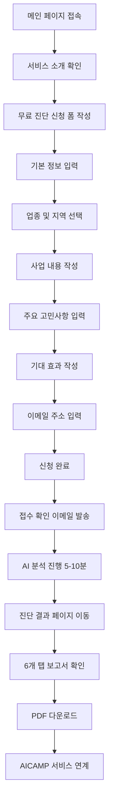
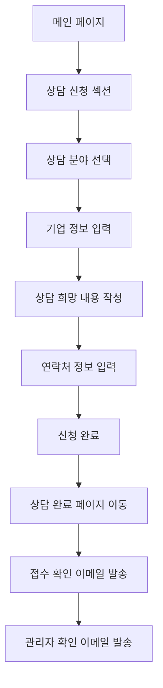
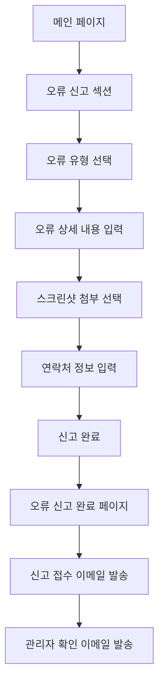
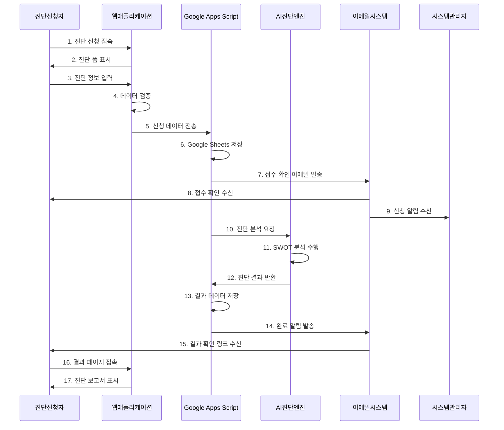
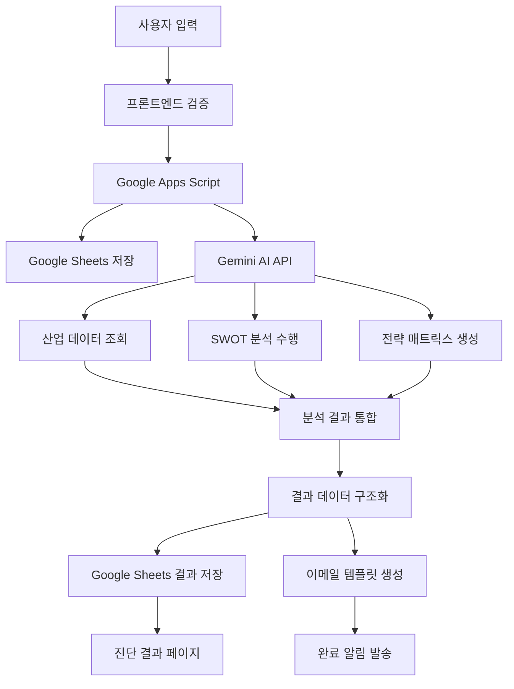

# AICAMP 무료 AI 경영진단 시스템 PRD

## 1. 제품 상세 설명

### 1.1 제품 개요
AICAMP 무료 AI 경영진단 시스템은 기업 경영자와 임원진을 위한 최고수준의 AI 기반 경영진단 및 전략 수립 플랫폼입니다. 신청자가 제공한 업종, 지역, 사업 정보, 주요 고민사항, 기대 효과를 종합 분석하여 맞춤형 경영진단 보고서를 자동 생성합니다.

### 1.2 핵심 가치 제안
- **개인화된 진단**: 신청자의 업종과 요청사항을 100% 반영한 맞춤형 분석
- **전문가 수준의 보고서**: SWOT 분석 기반의 체계적인 경영 전략 제시  
- **실행 가능한 로드맵**: 구체적인 3단계 실행 계획과 월별 타임라인 제공
- **AICAMP 서비스 연계**: 진단 결과에 기반한 교육 프로그램 및 컨설팅 매칭

### 1.3 제품 목표
- 중소기업 및 스타트업의 경영진단 접근성 향상
- AI 기술을 통한 경영 컨설팅의 민주화
- AICAMP 교육 서비스와의 시너지 창출
- 사용자 친화적인 경영진단 경험 제공

### 1.4 시스템 구현 상태 (2025년 1월 업데이트)
- **프론트엔드**: Next.js 14 기반 구현 완료
- **진단 신청 폼**: `/diagnosis` 페이지에 구현
- **결과 페이지**: `/diagnosis/result/[id]` 동적 라우팅 구현
- **완료 페이지**: 상담/오류신고 완료 페이지 구현
- **Google Apps Script**: 
  - 독립 파일: `docs/google_apps_script_free_diagnosis.js` 
  - 통합 파일: `docs/google_apps_script_simplified_NO_PDF.js` (기존 시스템과 통합 완료)
- **API 연동**: `/api/free-diagnosis` 엔드포인트 구현

## 2. 참고 서비스 및 상세 근거

### 2.1 벤치마킹 서비스

| 서비스명 | 특징 | 차별화 포인트 |
|---------|------|--------------|
| **McKinsey Solutions** | 전문 컨설팅 진단 도구 | 무료 접근성, AI 자동화 |
| **KPMG Business Analytics** | 데이터 기반 기업 분석 | 중소기업 특화, 한국어 지원 |
| **삼정KPMG 경영진단** | 국내 기업 진단 서비스 | AI 기반 실시간 분석 |
| **중소벤처기업부 기업진단** | 정부 지원 진단 서비스 | 민간 전문성, 개인화 |

### 2.2 차별화 전략 근거
- **접근성**: 기존 컨설팅 서비스 대비 무료 제공으로 진입장벽 해소
- **속도**: AI 기반 실시간 분석으로 즉시 결과 제공 (기존 2-4주 → 즉시)
- **개인화**: 신청자별 맞춤형 분석 (일반화된 템플릿 탈피)
- **연계성**: 진단 후 교육/컨설팅 서비스 자연스러운 연결

## 3. 핵심 기능 및 사양

### 3.1 프리미엄 진단 엔진
| 기능 | 상세 사양 |
|------|----------|
| **업종별 분석** | 200+ 업종 데이터베이스 기반 맞춤 분석 |
| **실시간 산업분석** | 최신 산업 트렌드 및 시장 데이터 반영 |
| **8개 섹션 보고서** | 경영환경, SWOT, 전략, 실행계획, 리스크, 기회, 제언, 서비스연계 |
| **AI 엔진** | Gemini 2.5 Flash 기반 고도화된 분석 |

### 3.2 SWOT 전략 매트릭스
- **SO 전략**: 강점과 기회 결합 전략
- **WO 전략**: 약점 보완을 통한 기회 활용
- **ST 전략**: 강점을 활용한 위협 대응
- **WT 전략**: 약점과 위협 동시 해결
- **우선순위 매트릭스**: 실행 가능성과 임팩트 기준 순위화

### 3.3 실행 로드맵 시스템
| 단계 | 기간 | 주요 활동 |
|------|------|----------|
| **1단계** | 1-3개월 | 즉시 실행 가능한 개선사항 |
| **2단계** | 4-9개월 | 중기 전략 실행 |
| **3단계** | 10-12개월 | 장기 비전 달성 |

### 3.4 프리미엄 UI 컴포넌트
- **6개 탭 인터랙티브 보고서**: 개요, SWOT, 전략, 로드맵, 벤치마크, 추천서비스
- **반응형 디자인**: 모바일/태블릿/PC 최적화
- **실시간 차트**: 벤치마크 비교 및 성과 지표 시각화
- **PDF 다운로드**: 고품질 보고서 저장 기능

## 4. 추가 제안 기능

### 4.1 고도화 기능
- **경쟁사 비교 분석**: 동종 업계 기업과의 벤치마킹
- **재무 건전성 진단**: 간단한 재무 데이터 입력 시 재무 분석 추가
- **시장 진입 전략**: 신규 시장 진출 계획 수립 지원
- **디지털 전환 로드맵**: 업종별 디지털화 전략 제안

### 4.2 사용자 경험 개선
- **진단 히스토리**: 이전 진단 결과와 비교 분석
- **알림 시스템**: 실행 계획 리마인더 및 업데이트 알림
- **커뮤니티 기능**: 동종 업계 경영진간 네트워킹
- **전문가 Q&A**: 진단 결과 관련 전문가 상담 연결

### 4.3 데이터 분석 기능
- **진단 트렌드 분석**: 업종별/지역별 진단 동향 제공
- **성공 사례 매칭**: 유사 기업의 성공 전략 사례 추천
- **KPI 추적**: 핵심 성과 지표 모니터링 대시보드

## 5. 사용자 페르소나 및 시나리오

### 5.1 주요 페르소나

#### 페르소나 1: 중소기업 CEO (김경영, 45세)
- **배경**: 제조업 15년 경력, 직원 50명 규모
- **고민**: 디지털 전환 필요성 인식하지만 구체적 방향 모름
- **목표**: 체계적인 경영 진단을 통한 성장 전략 수립
- **사용 시나리오**: 
  1. 무료 진단 신청 (업종: 제조업, 고민: 디지털 전환)
  2. SWOT 분석 결과 확인
  3. 3단계 디지털 전환 로드맵 수령
  4. AICAMP 디지털 리더십 교육 과정 신청

#### 페르소나 2: 스타트업 창업자 (이창업, 32세)
- **배경**: IT 서비스 스타트업 2년차, 직원 10명
- **고민**: 사업 확장을 위한 투자 유치 전략 필요
- **목표**: 투자자 대상 사업 계획서 보강 자료 확보
- **사용 시나리오**:
  1. 무료 진단 신청 (업종: IT서비스, 고민: 투자유치)
  2. 시장 기회 분석 및 경쟁 우위 확인
  3. 투자 유치를 위한 전략 로드맵 활용
  4. AICAMP 투자 유치 교육 과정 참여

#### 페르소나 3: 중견기업 사업부장 (박사업, 48세)
- **배경**: 유통업 사업부 총괄, 매출 100억 규모
- **고민**: 온라인 진출 및 O2O 전략 수립
- **목표**: 기존 오프라인 강점을 활용한 디지털 진출
- **사용 시나리오**:
  1. 무료 진단 신청 (업종: 유통업, 고민: 온라인 진출)
  2. O2O 전략 및 디지털 마케팅 방안 확인
  3. 단계별 온라인 진출 계획 수립
  4. AICAMP 디지털 마케팅 전문가 컨설팅 연결

### 5.2 핵심 사용 시나리오

#### 시나리오 A: 첫 진단 신청부터 결과 확인까지
```
1. 홈페이지 접속 → 무료 진단 신청 버튼 클릭
2. 기본 정보 입력 (업종, 지역, 사업내용)
3. 경영 고민사항 및 기대효과 작성
4. 신청 완료 → 접수 확인 이메일 수신
5. AI 분석 완료 알림 (5-10분 내)
6. 진단 결과 보고서 확인
7. PDF 다운로드 및 AICAMP 서비스 추천 확인
```

#### 시나리오 B: 진단 결과 활용 및 서비스 연계
```
1. 진단 보고서 내 SWOT 분석 검토
2. 실행 로드맵의 1단계 실행 계획 확인
3. 추천 교육 과정 또는 컨설팅 서비스 검토
4. AICAMP 서비스 신청 또는 전문가 상담 예약
5. 3개월 후 재진단을 통한 개선 효과 측정
```

## 6. 기술 스택 추천

### 6.1 프론트엔드
| 기술 | 선택 근거 |
|------|----------|
| **Next.js 14** | React 기반 SSR/SSG 지원, SEO 최적화 |
| **TypeScript** | 타입 안정성, 대규모 프로젝트 관리 용이 |
| **Tailwind CSS** | 빠른 UI 개발, 반응형 디자인 용이 |
| **Chart.js / Recharts** | 데이터 시각화, 인터랙티브 차트 |
| **React Hook Form** | 폼 관리 및 유효성 검사 |

### 6.2 백엔드 및 AI
| 기술 | 선택 근거 |
|------|----------|
| **Google Apps Script** | 구글 서비스 연동, 이메일 발송 자동화 |
| **Google Gemini 2.5 Flash** | 고성능 AI 분석, 한국어 지원 우수 |
| **Google Sheets API** | 데이터 저장 및 관리 (로컬 저장 요구사항) |
| **Gmail API** | 자동 이메일 발송 시스템 |

### 6.3 개발 및 배포
| 기술 | 선택 근거 |
|------|----------|
| **Vercel** | Next.js 최적화, 빠른 배포 |
| **GitHub Actions** | CI/CD 파이프라인 |
| **ESLint + Prettier** | 코드 품질 관리 |
| **Jest + Testing Library** | 단위 테스트 및 통합 테스트 |

### 6.4 모바일 및 크로스플랫폼
| 플랫폼 | 기술 | 근거 |
|--------|------|------|
| **웹** | PWA (Progressive Web App) | 네이티브 앱과 유사한 UX |
| **iOS/Android** | React Native (추후 확장) | 코드 재사용성, 빠른 개발 |
| **데스크톱** | Electron (선택사항) | 웹 기술 활용한 데스크톱 앱 |

### 6.5 보안 및 성능
- **HTTPS/SSL**: 데이터 전송 보안
- **Rate Limiting**: API 남용 방지
- **Content Security Policy**: XSS 공격 방지
- **Lazy Loading**: 성능 최적화
- **CDN**: 글로벌 배포 최적화

### 6.6 모니터링 및 분석
- **Google Analytics 4**: 사용자 행동 분석
- **Hotjar**: 사용자 경험 분석
- **Sentry**: 에러 모니터링
- **Lighthouse**: 성능 모니터링

---

**주의사항**: 
- 모든 사용자 인터페이스는 한국어로 제공
- 폴백 답변 시스템 사용 금지 (항상 맞춤형 분석 제공)
- 마크다운 특수문자(*** 등) 사용 금지한 자연스러운 보고서 형식
- Google Apps Script 기반 이메일 시스템 필수 구현
- 신청자와 관리자 모두에게 접수 확인 이메일 발송 시스템 구축

### 6.7 Google Apps Script 설정 가이드

#### 옵션 1: 독립 스크립트 사용 (권장)
1. **스프레드시트 생성**
   - Google Drive에서 새 스프레드시트 생성
   - 시트명: "AICAMP 무료 AI 경영진단 데이터"
   - 시트 ID를 `google_apps_script_free_diagnosis.js`의 `SHEETS_ID`에 입력

2. **Apps Script 프로젝트 생성**
   - 확장 프로그램 → Apps Script 선택
   - `google_apps_script_free_diagnosis.js` 내용 복사하여 붙여넣기
   - 프로젝트 설정에서 Gemini API 키 추가
   - 웹앱으로 배포 (실행: 나, 액세스: 모든 사용자)

3. **환경 변수 설정**
   - `.env.local`에 `NEXT_PUBLIC_GAS_URL=배포된_웹앱_URL` 추가

4. **권한 설정**
   - Gmail 발송 권한 허용
   - Sheets 읽기/쓰기 권한 허용
   - URL Fetch (Gemini API 호출) 권한 허용

#### 옵션 2: 통합 스크립트 사용 (기존 시스템 활용)
1. **기존 스프레드시트 활용**
   - 이미 운영 중인 AICAMP 진단 시스템의 스프레드시트 사용
   - 새로운 시트 자동 생성: '무료진단신청', '무료진단결과'

2. **통합 스크립트 사용**
   - `google_apps_script_simplified_NO_PDF.js` 사용
   - 이미 포함된 기능:
     - `handleFreeDiagnosisSubmission`: 무료 진단 신청 처리
     - `handleGetFreeDiagnosisResult`: 진단 결과 조회
     - `parseFreeDiagnosisText`: AI 응답 텍스트 파싱
     - `testFreeDiagnosisSystem`: 시스템 테스트

3. **API 호출 방법**
   ```javascript
   // 진단 신청
   {
     action: 'submitFreeDiagnosis',
     data: {
       companyName: '기업명',
       representativeName: '대표자명',
       // ... 기타 필드
     }
   }
   
   // 결과 조회
   {
     action: 'getDiagnosisResult',
     diagnosisId: 'FREE-20250101-001'
   }
   ```

4. **테스트 실행**
   - Google Apps Script 편집기에서 `testFreeDiagnosisSystem()` 함수 실행
   - 또는 POST 요청으로 테스트:
   ```javascript
   {
     action: 'internalTest',
     functionName: 'testFreeDiagnosisSystem'
   }
   ```


# AICAMP 무료 AI 경영진단 시스템 정보 구조 설계서 (IA)

## 1. 사이트 맵

### 1.1 전체 구조도
```
AICAMP 무료 AI 경영진단 시스템
│
├── 메인 페이지 (/)
│   ├── 서비스 소개 섹션
│   ├── 무료 진단 신청 폼
│   ├── 상담 신청 폼 
│   └── 오류 신고 폼
│
├── 진단 결과 페이지 (/result)
│   ├── 진단 결과 개요
│   ├── SWOT 분석 탭
│   ├── 전략 매트릭스 탭
│   ├── 실행 로드맵 탭
│   ├── 벤치마크 비교 탭
│   └── AICAMP 서비스 추천 탭
│
├── 상담 완료 페이지 (/consultation-complete)
│   ├── 접수 확인 메시지
│   └── 다음 단계 안내
│
├── 오류 신고 완료 페이지 (/error-report-complete)
│   ├── 신고 접수 확인
│   └── 처리 안내
│
└── 서비스 안내 페이지 (/about)
    ├── AICAMP 소개
    ├── 진단 시스템 특징
    └── 문의 정보
```

### 1.2 페이지별 상세 구조

| 페이지 | URL | 주요 기능 | 접근 방식 |
|--------|-----|----------|----------|
| **메인 페이지** | `/` | 진단신청, 상담신청, 오류신고 | 직접 접근 |
| **진단 결과** | `/result/:id` | 6개 탭 진단 보고서 | 진단 완료 후 이동 |
| **상담 완료** | `/consultation-complete` | 상담 접수 확인 | 상담 신청 후 이동 |
| **오류 신고 완료** | `/error-report-complete` | 오류 신고 접수 확인 | 오류 신고 후 이동 |
| **서비스 안내** | `/about` | AICAMP 소개 | 메인에서 링크 |

## 2. 사용자 플로우

### 2.1 무료 AI 진단 플로우


### 2.2 상담 신청 플로우


### 2.3 오류 신고 플로우


## 3. 네비게이션 구조

### 3.1 네비게이션 타입: 없음 (None)
- **단일 페이지 중심 설계**: 메인 페이지에서 모든 기능 접근
- **액션 기반 이동**: 폼 제출 후 결과 페이지로 자동 이동
- **브래드크럼 없음**: 선형적 사용자 경험 제공

### 3.2 페이지 간 이동 방식

| 출발 페이지 | 목적 페이지 | 이동 방식 | 트리거 |
|------------|------------|----------|--------|
| 메인 | 진단 결과 | 자동 리다이렉트 | 진단 신청 완료 |
| 메인 | 상담 완료 | 자동 리다이렉트 | 상담 신청 완료 |
| 메인 | 오류 신고 완료 | 자동 리다이렉트 | 오류 신고 완료 |
| 진단 결과 | 메인 | 버튼 클릭 | "새 진단 신청" |
| 완료 페이지 | 메인 | 버튼 클릭 | "홈으로 돌아가기" |

### 3.3 모바일 네비게이션 고려사항
- **햄버거 메뉴 없음**: 단순한 구조로 불필요
- **플로팅 액션 버튼**: 긴 페이지에서 주요 액션 접근
- **탭 네비게이션**: 진단 결과 페이지 내 6개 탭 구조

## 4. 페이지 계층 구조

### 4.1 계층별 중요도
```
Level 1 (최고 중요도)
├── 메인 페이지 (/)
└── 진단 결과 페이지 (/result/:id)

Level 2 (중간 중요도)
├── 상담 완료 페이지 (/consultation-complete)
└── 오류 신고 완료 페이지 (/error-report-complete)

Level 3 (낮은 중요도)
└── 서비스 안내 페이지 (/about)
```

### 4.2 페이지별 권한 구조
| 페이지 | 접근 권한 | 인증 필요 | 특별 조건 |
|--------|----------|----------|----------|
| 메인 페이지 | 모든 사용자 | 없음 | 없음 |
| 진단 결과 | 진단 신청자 | 없음 | 유효한 진단 ID 필요 |
| 상담 완료 | 상담 신청자 | 없음 | 상담 신청 후에만 접근 |
| 오류 신고 완료 | 오류 신고자 | 없음 | 오류 신고 후에만 접근 |
| 서비스 안내 | 모든 사용자 | 없음 | 없음 |

## 5. 콘텐츠 조직 구조

### 5.1 메인 페이지 콘텐츠 구조
```
헤더 영역
├── AICAMP 로고
├── 서비스 제목
└── 간단한 소개

히어로 섹션
├── 무료 진단 주요 메시지
├── 핵심 가치 제안 (3개 포인트)
└── CTA 버튼

무료 진단 신청 섹션
├── 폼 제목 및 설명
├── 기본 정보 입력 필드
├── 업종/지역 선택 드롭다운
├── 사업 내용 텍스트 영역
├── 고민사항 체크박스 + 기타 입력
├── 기대 효과 텍스트 영역
└── 이메일 주소 입력

상담 신청 섹션
├── 상담 서비스 소개
├── 상담 분야 선택
├── 기업 정보 입력
└── 상담 내용 작성

오류 신고 섹션
├── 오류 신고 안내
├── 오류 유형 선택
├── 상세 내용 입력
└── 첨부 파일 업로드

푸터 영역
├── AICAMP 정보
├── 연락처
└── 이용약관
```

### 5.2 진단 결과 페이지 콘텐츠 구조
```
헤더 영역
├── 진단 완료 메시지
├── 기업명 및 진단일시
└── PDF 다운로드 버튼

탭 네비게이션 (6개)
├── 1. 진단 개요
├── 2. SWOT 분석  
├── 3. 전략 매트릭스
├── 4. 실행 로드맵
├── 5. 벤치마크 비교
└── 6. AICAMP 서비스 추천

각 탭별 콘텐츠
├── 섹션 제목 및 요약
├── 시각화 차트/그래프
├── 상세 분석 내용
└── 핵심 인사이트 강조

액션 영역
├── 새 진단 신청 버튼
├── 상담 신청 바로가기
└── 소셜 공유 버튼
```

### 5.3 콘텐츠 우선순위 매트릭스

| 콘텐츠 유형 | 중요도 | 표시 위치 | 모바일 처리 |
|------------|-------|----------|------------|
| **진단 신청 폼** | 최고 | 상단 히어로 | 전체 화면 |
| **진단 결과** | 최고 | 메인 콘텐츠 | 탭 구조 유지 |
| **서비스 소개** | 높음 | 상단 섹션 | 축약 표시 |
| **상담 신청** | 중간 | 중간 섹션 | 접기/펼치기 |
| **오류 신고** | 낮음 | 하단 섹션 | 모달 팝업 |

## 6. 상호작용 패턴

### 6.1 폼 상호작용 패턴
```
입력 필드 상호작용
├── 실시간 유효성 검사
├── 자동 완성 기능 (업종, 지역)
├── 글자 수 카운터 (텍스트 영역)
├── 필수 필드 시각적 표시
└── 오류 메시지 인라인 표시

진행 상황 표시
├── 폼 작성 진행률 바
├── 단계별 완료 체크마크
├── AI 분석 진행 로딩 애니메이션
└── 예상 완료 시간 표시

피드백 시스템
├── 성공 알림 토스트
├── 오류 알림 배너
├── 확인 모달 팝업
└── 이메일 발송 상태 표시
```

### 6.2 진단 결과 상호작용 패턴
```
탭 네비게이션
├── 클릭/터치로 탭 전환
├── 스와이프 제스처 지원 (모바일)
├── 키보드 네비게이션 지원
└── 현재 탭 시각적 강조

차트 상호작용
├── 호버 시 상세 정보 툴팁
├── 클릭 시 확대 보기
├── 터치 시 정보 표시 (모바일)
└── 범례 클릭으로 데이터 필터링

콘텐츠 상호작용
├── 접기/펼치기 아코디언
├── 더보기/간략히 토글
├── 인쇄 친화적 뷰
└── 소셜 미디어 공유
```

### 6.3 반응형 상호작용 패턴

| 화면 크기 | 주요 상호작용 | 입력 방식 | 특별 고려사항 |
|----------|-------------|----------|-------------|
| **모바일 (< 768px)** | 터치, 스와이프 | 가상 키보드 | 단일 컬럼 레이아웃 |
| **태블릿 (768-1024px)** | 터치, 키보드 | 하이브리드 | 2컬럼 레이아웃 |
| **데스크톱 (> 1024px)** | 마우스, 키보드 | 물리 키보드 | 3컬럼 레이아웃 |

## 7. URL 구조

### 7.1 URL 스키마
```
도메인: https://aicamp.club

메인 페이지
├── / (홈페이지)
└── /about (서비스 소개)

진단 관련
├── /diagnosis/apply (진단 신청 - 리다이렉트)
├── /diagnosis/result/:id (진단 결과)
└── /diagnosis/download/:id (PDF 다운로드)

상담 관련
├── /consultation/apply (상담 신청 - 리다이렉트)
└── /consultation/complete (상담 완료)

오류 신고 관련
├── /error-report/submit (오류 신고 - 리다이렉트)
└── /error-report/complete (신고 완료)

API 엔드포인트
├── /api/diagnosis/submit (POST)
├── /api/consultation/submit (POST)
├── /api/error-report/submit (POST)
└── /api/diagnosis/result/:id (GET)
```

### 7.2 URL 설계 원칙

| 원칙 | 설명 | 예시 |
|------|------|------|
| **의미있는 구조** | URL만으로 페이지 내용 파악 가능 | `/diagnosis/result/abc123` |
| **계층적 구조** | 논리적 계층 반영 | `/diagnosis/result/:id` |
| **한국어 지원** | 한글 슬러그 허용 | `/about/경영진단-소개` |
| **SEO 최적화** | 검색엔진 친화적 구조 | `/free-business-diagnosis` |
| **단순성** | 깊이 3단계 이하 유지 | `/category/subcategory/page` |

### 7.3 리다이렉트 및 오류 처리
```
리다이렉트 규칙
├── /diagnosis/apply → / (302 임시 리다이렉트)
├── /consultation/apply → / (302 임시 리다이렉트)
├── /error-report/submit → / (302 임시 리다이렉트)
└── 잘못된 진단 ID → / (404 페이지 없음)

오류 페이지
├── 404.html (페이지 없음)
├── 500.html (서버 오류)
└── offline.html (오프라인 상태)
```

## 8. 컴포넌트 계층 구조

### 8.1 최상위 컴포넌트 구조
```
App
├── Header
│   ├── Logo
│   ├── Navigation (미사용)
│   └── LanguageSelector
├── Main
│   ├── Router
│   └── PageComponents
├── Footer
│   ├── CompanyInfo
│   ├── ContactInfo
│   └── LegalLinks
└── GlobalComponents
    ├── LoadingSpinner
    ├── Toast
    └── Modal
```

### 8.2 페이지별 컴포넌트 분해

#### 메인 페이지 (HomePage)
```
HomePage
├── HeroSection
│   ├── MainHeading
│   ├── ValuePropositions
│   └── CTAButton
├── DiagnosisFormSection
│   ├── FormContainer
│   │   ├── BasicInfoForm
│   │   ├── IndustrySelector
│   │   ├── BusinessContentForm
│   │   ├── ConcernsCheckboxes
│   │   ├── ExpectationsForm
│   │   └── EmailForm
│   ├── ProgressIndicator
│   └── SubmitButton
├── ConsultationSection
│   ├── ConsultationForm
│   └── ServiceDescription
├── ErrorReportSection
│   ├── ErrorReportForm
│   └── SupportInfo
└── FeaturesSection
    ├── FeatureCard (x3)
    └── TestimonialCard
```

#### 진단 결과 페이지 (DiagnosisResultPage)
```
DiagnosisResultPage
├── ResultHeader
│   ├── CompanyInfo
│   ├── DiagnosisDate
│   └── DownloadButton
├── TabNavigation
│   ├── TabButton (x6)
│   └── TabIndicator
├── TabContent
│   ├── OverviewTab
│   │   ├── ExecutiveSummary
│   │   ├── KeyMetrics
│   │   └── OverallScore
│   ├── SWOTTab
│   │   ├── SWOTMatrix
│   │   ├── StrengthsList
│   │   ├── WeaknessesList
│   │   ├── OpportunitiesList
│   │   └── ThreatsList
│   ├── StrategyTab
│   │   ├── StrategyMatrix
│   │   ├── SOStrategy
│   │   ├── WOStrategy
│   │   ├── STStrategy
│   │   └── WTStrategy
│   ├── RoadmapTab
│   │   ├── TimelineChart
│   │   ├── Phase1Actions
│   │   ├── Phase2Actions
│   │   └── Phase3Actions
│   ├── BenchmarkTab
│   │   ├── IndustryComparison
│   │   ├── CompetitorAnalysis
│   │   └── PerformanceChart
│   └── RecommendationTab
│       ├── AICampServices
│       ├── EducationPrograms
│       └── ConsultingServices
└── ActionSection
    ├── NewDiagnosisButton
    ├── ConsultationButton
    └── ShareButtons
```

### 8.3 공통 컴포넌트 라이브러리

#### 폼 컴포넌트
```
Form Components
├── Input
│   ├── TextInput
│   ├── EmailInput
│   ├── TextArea
│   └── FileUpload
├── Selection
│   ├── Dropdown
│   ├── Checkbox
│   ├── RadioGroup
│   └── MultiSelect
├── Validation
│   ├── ErrorMessage
│   ├── SuccessMessage
│   └── ValidationIcon
└── Layout
    ├── FormGroup
    ├── FormRow
    └── FormSection
```

#### UI 컴포넌트
```
UI Components
├── Layout
│   ├── Container
│   ├── Grid
│   ├── Card
│   └── Section
├── Navigation
│   ├── Tab
│   ├── Breadcrumb
│   └── Pagination
├── Feedback
│   ├── Alert
│   ├── Toast
│   ├── Modal
│   └── Tooltip
├── Data Display
│   ├── Chart
│   ├── Table
│   ├── Badge
│   └── Progress
└── Actions
    ├── Button
    ├── IconButton
    ├── Link
    └── Dropdown
```

### 8.4 반응형 컴포넌트 고려사항

| 컴포넌트 유형 | 모바일 동작 | 태블릿 동작 | 데스크톱 동작 |
|-------------|-----------|-----------|-------------|
| **폼 레이아웃** | 단일 컬럼 | 2컬럼 | 3컬럼 |
| **탭 네비게이션** | 스크롤 가능 | 전체 표시 | 전체 표시 |
| **차트** | 간소화 표시 | 중간 상세도 | 전체 상세도 |
| **모달** | 전체 화면 | 중앙 팝업 | 중앙 팝업 |

### 8.5 접근성 고려사항

#### 키보드 네비게이션
- 모든 인터랙티브 요소 Tab 키로 접근 가능
- 논리적 탭 순서 (좌→우, 위→아래)
- Skip to main content 링크 제공
- 포커스 표시 명확하게 시각화

#### 스크린 리더 지원
- 의미있는 heading 구조 (h1 → h6)
- 이미지 alt 텍스트 제공
- 폼 레이블과 입력 필드 연결
- ARIA 레이블 및 속성 활용

#### 색상 및 대비
- WCAG 2.1 AA 수준 색상 대비 준수
- 색상만으로 정보 전달 금지
- 고대비 모드 지원
- 색맹 사용자 고려한 색상 선택

---

**SEO 최적화 고려사항**:
- 구조화된 데이터 마크업 (JSON-LD)
- 메타 태그 및 Open Graph 설정
- 사이트맵 자동 생성
- 로봇.txt 설정
- 페이지 로딩 속도 최적화 (Core Web Vitals)


# AICAMP 무료 AI 경영진단 시스템 유스케이스 문서

## 1. 액터 정의 (Actor Definitions)

### 1.1 주요 액터 (Primary Actors)

| 액터명 | 설명 | 역할 | 권한 |
|--------|------|------|------|
| **진단 신청자** | 무료 AI 경영진단을 신청하는 기업 관계자 | 진단 신청, 결과 확인, PDF 다운로드 | 진단 관련 모든 기능 |
| **상담 신청자** | 전문가 상담을 신청하는 기업 관계자 | 상담 신청, 접수 확인 | 상담 신청 기능 |
| **오류 신고자** | 시스템 오류를 신고하는 사용자 | 오류 신고, 피드백 제공 | 오류 신고 기능 |
| **시스템 관리자** | AICAMP 시스템을 관리하는 운영진 | 신청 관리, 오류 처리, 시스템 모니터링 | 관리자 권한 |

### 1.2 보조 액터 (Secondary Actors)

| 액터명 | 설명 | 역할 | 상호작용 |
|--------|------|------|---------|
| **AI 진단 엔진** | Gemini 2.5 Flash 기반 분석 시스템 | 경영진단 분석, 보고서 생성 | API 호출 |
| **Google Apps Script** | 백엔드 처리 및 데이터 관리 | 데이터 저장, 이메일 발송 | 자동 실행 |
| **이메일 시스템** | Gmail API 기반 메일 발송 | 접수/완료 알림 발송 | 자동 발송 |
| **Google Sheets** | 데이터 저장소 | 신청 데이터, 진단 결과 저장 | 읽기/쓰기 |

## 2. 유스케이스 시나리오 (Use Case Scenarios)

### 2.1 주요 유스케이스 목록

| UC-ID | 유스케이스명 | 주요 액터 | 우선순위 | 복잡도 |
|-------|-------------|----------|----------|---------|
| **UC-001** | 무료 AI 경영진단 신청 | 진단 신청자 | 높음 | 높음 |
| **UC-002** | 진단 결과 확인 및 다운로드 | 진단 신청자 | 높음 | 중간 |
| **UC-003** | 전문가 상담 신청 | 상담 신청자 | 중간 | 낮음 |
| **UC-004** | 시스템 오류 신고 | 오류 신고자 | 낮음 | 낮음 |
| **UC-005** | AICAMP 서비스 연계 | 진단 신청자 | 중간 | 중간 |

### 2.2 유스케이스 관계도
```
진단 신청자 ──┐
              ├─── UC-001: 무료 AI 경영진단 신청
              │     │
              │     ├─── <<include>> 기본 정보 입력
              │     ├─── <<include>> 업종 선택
              │     ├─── <<include>> 고민사항 입력
              │     └─── <<include>> 이메일 인증
              │
              ├─── UC-002: 진단 결과 확인
              │     │
              │     ├─── <<extend>> PDF 다운로드
              │     └─── <<extend>> 소셜 공유
              │
              └─── UC-005: AICAMP 서비스 연계
                     │
                     ├─── <<extend>> 교육 과정 신청
                     └─── <<extend>> 전문가 매칭

상담 신청자 ────── UC-003: 전문가 상담 신청

오류 신고자 ────── UC-004: 시스템 오류 신고
```

## 3. 주요 단계 (Main Steps)

### 3.1 UC-001: 무료 AI 경영진단 신청

#### 기본 플로우
1. **진단 신청자**가 메인 페이지에 접속한다
2. **시스템**이 무료 진단 신청 폼을 표시한다
3. **진단 신청자**가 기본 정보를 입력한다
   - 기업명, 대표자명, 직책
4. **진단 신청자**가 업종과 지역을 선택한다
5. **진단 신청자**가 사업/서비스 내용을 작성한다
6. **진단 신청자**가 주요 고민사항을 선택/입력한다
7. **진단 신청자**가 기대 효과를 작성한다
8. **진단 신청자**가 이메일 주소를 입력한다
9. **진단 신청자**가 "진단 신청" 버튼을 클릭한다
10. **시스템**이 입력 데이터를 검증한다
11. **Google Apps Script**가 데이터를 Google Sheets에 저장한다
12. **이메일 시스템**이 접수 확인 이메일을 발송한다
13. **AI 진단 엔진**이 경영진단 분석을 수행한다
14. **시스템**이 진단 결과를 생성한다
15. **시스템**이 진단 완료 알림을 발송한다
16. **진단 신청자**가 진단 결과 페이지로 이동한다

### 3.2 UC-002: 진단 결과 확인 및 다운로드

#### 기본 플로우
1. **진단 신청자**가 진단 결과 페이지에 접속한다
2. **시스템**이 진단 결과 개요를 표시한다
3. **진단 신청자**가 6개 탭 중 하나를 선택한다
   - 진단 개요, SWOT 분석, 전략 매트릭스, 실행 로드맵, 벤치마크 비교, AICAMP 서비스 추천
4. **시스템**이 선택된 탭의 상세 내용을 표시한다
5. **진단 신청자**가 다른 탭들을 탐색한다
6. **진단 신청자**가 "PDF 다운로드" 버튼을 클릭한다
7. **시스템**이 진단 보고서 PDF를 생성한다
8. **시스템**이 PDF 파일을 다운로드 제공한다

## 4. 예외 처리 (Exception Handling)

### 4.1 일반적 예외 상황

| 예외 유형 | 발생 시점 | 처리 방법 | 복구 방안 |
|----------|----------|----------|----------|
| **네트워크 연결 오류** | API 호출 시 | 재시도 메커니즘 (3회) | 오프라인 모드 안내 |
| **AI 엔진 응답 지연** | 진단 분석 중 | 타임아웃 처리 (10분) | 관리자 수동 처리 |
| **이메일 발송 실패** | 알림 발송 시 | 재발송 시도 (3회) | 관리자 알림 |
| **데이터 저장 실패** | 신청 완료 시 | 임시 저장 후 재시도 | 수동 데이터 복구 |

### 4.2 UC-001 상세 예외 처리

#### E-001: 필수 입력 필드 누락
- **발생 조건**: 필수 필드가 비어있거나 형식이 잘못된 경우
- **처리 방법**: 
  1. 해당 필드에 빨간색 테두리 표시
  2. 오류 메시지 표시 ("필수 정보를 입력해주세요")
  3. 해당 필드로 포커스 이동
- **복구 방안**: 올바른 정보 입력 후 재시도

#### E-002: 이메일 형식 오류
- **발생 조건**: 잘못된 이메일 형식 입력
- **처리 방법**:
  1. 실시간 유효성 검사
  2. "올바른 이메일 주소를 입력해주세요" 메시지 표시
  3. 예시 형식 제공 (예: user@company.com)
- **복구 방안**: 올바른 이메일 형식 입력

#### E-003: AI 분석 실패
- **발생 조건**: AI 엔진 오류 또는 분석 불가능한 데이터
- **처리 방법**:
  1. 관리자에게 즉시 알림 이메일 발송
  2. 신청자에게 "분석 지연" 안내 이메일 발송
  3. 24시간 내 수동 처리 또는 재분석
- **복구 방안**: 관리자 수동 개입 또는 시스템 재시작

## 5. 포괄적 액터 정의 (Comprehensive Actor Definitions)

### 5.1 진단 신청자 상세 정의

#### 특성
- **역할**: 기업 경영자, 임원, 팀장
- **목표**: 체계적인 경영진단을 통한 사업 개선 방향 수립
- **기술 수준**: 초급~중급 (IT 활용 능력 기본 수준)
- **사용 환경**: 주로 모바일/태블릿, 업무 시간 외 접근 많음

#### 행동 패턴
- **접근 시간**: 주로 저녁 시간대 (18:00-22:00)
- **사용 기기**: 스마트폰 60%, PC 30%, 태블릿 10%
- **관심 영역**: SWOT 분석, 실행 계획, 벤치마크 비교
- **완료율**: 신청 시작 후 80% 완료율 예상

#### 페인 포인트
- 복잡한 입력 폼에 대한 거부감
- 분석 결과의 신뢰성에 대한 의구심
- 즉시 결과를 원하는 성급함
- 전문 용어에 대한 이해 부족

### 5.2 시스템 관리자 상세 정의

#### 역할 및 책임
- **일차 책임**: 시스템 정상 운영 및 사용자 지원
- **업무 시간**: 평일 09:00-18:00 + 긴급 상황 24시간 대응
- **권한 범위**: 모든 데이터 조회, 수정, 삭제 권한
- **모니터링**: 실시간 시스템 상태 및 오류 모니터링

#### 관리 도구
- Google Sheets 대시보드
- 이메일 알림 시스템
- 시스템 로그 모니터링
- 사용자 피드백 관리

## 6. 상세 유스케이스 시나리오 (Detailed Use Case Scenarios)

### 6.1 UC-001: 무료 AI 경영진단 신청 (상세)

#### 시나리오 A: 제조업 중소기업 CEO의 디지털 전환 진단

**배경**: 김경영(45세)은 전통 제조업을 운영하는 CEO로, 최근 디지털 전환의 필요성을 느끼고 있음

**상세 플로우**:
1. **사전 조건**: 
   - 김경영이 AICAMP 웹사이트에 처음 방문
   - 스마트폰을 통해 저녁 시간에 접속
   - 디지털 전환에 대한 기본적 관심 보유

2. **메인 시나리오**:
   ```
   Step 1: 홈페이지 접속 및 탐색 (2분)
   - 19:30에 네이버 검색을 통해 접속
   - 서비스 소개 섹션을 스크롤하며 확인
   - "무료"라는 키워드에 관심 표시
   
   Step 2: 진단 신청 결정 (1분)
   - 핵심 가치 제안 3개 포인트 확인
   - "최고수준의 경영진단 보고서" 문구에 주목
   - "무료 진단 신청" 버튼 클릭
   
   Step 3: 기본 정보 입력 (3분)
   - 기업명: "대한정밀기계"
   - 대표자명: "김경영"
   - 직책: "대표이사"
   - 업종: 드롭다운에서 "제조업 > 기계/금속" 선택
   - 지역: "경기도 안산시" 선택
   
   Step 4: 사업 내용 작성 (5분)
   - "정밀 기계 부품 제조 및 납품, 자동차 부품 전문"
   - "20년 경력, 직원 50명, 연매출 100억"
   - 글자 수 제한 확인하며 작성
   
   Step 5: 고민사항 선택 (2분)
   - 체크박스: "디지털 전환", "생산성 향상" 선택
   - 기타 입력: "4차 산업혁명 대응 방안"
   
   Step 6: 기대 효과 작성 (3분)
   - "스마트 팩토리 도입 방향성 확보"
   - "디지털 전환 로드맵 수립"
   
   Step 7: 이메일 입력 및 제출 (1분)
   - kim@daehanprecision.com 입력
   - 개인정보 처리 동의 체크
   - "진단 신청" 버튼 클릭
   ```

3. **시스템 처리**:
   ```
   Step 8: 데이터 검증 및 저장 (30초)
   - 모든 필수 필드 검증 완료
   - Google Sheets에 신청 데이터 저장
   - 고유 진단 ID 생성: DIAG-20250801-001
   
   Step 9: 접수 확인 처리 (1분)
   - 신청자에게 접수 확인 이메일 발송
   - 관리자에게 신청 알림 이메일 발송
   - 진행 상황 페이지로 리다이렉트
   
   Step 10: AI 분석 실행 (5-8분)
   - Gemini 2.5 Flash API 호출
   - 제조업 특화 분석 템플릿 적용
   - 디지털 전환 관련 산업 데이터 수집
   - SWOT 분석 및 전략 매트릭스 생성
   ```

4. **후속 처리**:
   ```
   Step 11: 결과 생성 완료 (1분)
   - 8개 섹션 진단 보고서 완성
   - 진단 완료 알림 이메일 발송
   - 결과 확인 링크 제공
   
   Step 12: 결과 확인 (김경영의 다음 액션)
   - 이메일 링크 클릭하여 결과 페이지 접속
   - 6개 탭 순차적 확인
   - PDF 다운로드 및 저장
   ```

#### 시나리오 B: 스타트업 창업자의 투자 유치 준비

**배경**: 이창업(32세)은 IT 서비스 스타트업을 운영하며, 시리즈 A 투자 유치를 준비 중

**특수 고려사항**:
- 빠른 결과 필요 (투자 미팅 전날)
- 데이터 기반 객관적 분석 원함
- 경쟁사 비교 정보 중요시

### 6.2 UC-003: 전문가 상담 신청 (상세)

#### 시나리오: 진단 결과 후 심화 컨설팅 요청

1. **사전 조건**:
   - 무료 진단 완료 및 결과 확인
   - AICAMP 서비스 추천 탭에서 전문가 상담 확인
   - 구체적 실행 지원 필요성 인식

2. **상담 신청 플로우**:
   ```
   Step 1: 상담 신청 섹션 접근
   - 진단 결과 페이지 내 "전문가 상담 신청" 버튼 클릭
   - 메인 페이지 상담 신청 섹션으로 스크롤
   
   Step 2: 상담 분야 선택
   - 드롭다운 메뉴: "디지털 전환 컨설팅" 선택
   - 추가 옵션: "실행 계획 수립 지원" 체크
   
   Step 3: 기업 정보 입력
   - 기존 진단 ID 자동 연결
   - 추가 정보: 예산 규모, 진행 일정
   
   Step 4: 상담 희망 내용 작성
   - "스마트 팩토리 도입 1단계 실행 계획 구체화"
   - "ROI 분석 및 투자 우선순위 설정"
   
   Step 5: 상담 신청 완료
   - 연락처 정보 확인
   - 희망 상담 시기 선택
   - 신청 완료 및 확인 이메일 수신
   ```

## 7. 주요 단계 및 이벤트 플로우 (Main Steps and Flow of Events)

### 7.1 전체 시스템 이벤트 플로우



### 7.2 상세 이벤트 타이밍

| 이벤트 | 소요 시간 | 성공 조건 | 실패 처리 |
|--------|----------|----------|----------|
| **폼 데이터 검증** | 1-2초 | 모든 필수 필드 유효 | 오류 메시지 표시 |
| **데이터 저장** | 2-3초 | Google Sheets 저장 완료 | 재시도 3회 |
| **이메일 발송** | 5-10초 | SMTP 전송 성공 | 재발송 시도 |
| **AI 분석** | 5-10분 | API 응답 수신 | 타임아웃 후 수동 처리 |
| **결과 페이지 생성** | 3-5초 | HTML 렌더링 완료 | 캐시된 결과 표시 |

## 8. 대안 플로우 및 엣지 케이스 (Alternative Flows and Edge Cases)

### 8.1 대안 플로우

#### AF-001: 부분 입력 후 페이지 이탈
**상황**: 사용자가 폼을 절반만 작성하고 페이지를 떠남
```
1. 시스템이 5분 간격으로 로컬 스토리지에 임시 저장
2. 재방문 시 "이전에 작성하던 내용이 있습니다" 알림 표시
3. 사용자 선택: 이어서 작성 / 새로 시작
4. 24시간 후 임시 데이터 자동 삭제
```

#### AF-002: 중복 신청 시도
**상황**: 같은 이메일로 24시간 내 재신청 시도
```
1. 시스템이 이메일 중복 검사 수행
2. "최근 24시간 내 신청 이력이 있습니다" 메시지 표시
3. 기존 진단 결과 링크 제공
4. 신규 신청 차단 (스팸 방지)
```

#### AF-003: AI 분석 실패 시 폴백 처리
**상황**: AI 엔진 오류로 자동 분석 불가능
```
1. 시스템이 AI 응답 타임아웃 감지 (10분)
2. 관리자에게 즉시 알림 발송
3. 신청자에게 "분석 지연" 안내 이메일 발송
4. 관리자가 수동으로 간소화된 분석 제공
5. 48시간 내 완전한 분석 재시도
```

### 8.2 엣지 케이스

#### EC-001: 특수 업종 또는 신규 사업 모델
**문제**: 기존 업종 분류에 맞지 않는 신규 비즈니스
**해결**:
- "기타" 옵션 제공 및 상세 설명 입력란
- AI 분석 시 유사 업종 매핑 로직 적용
- 관리자 검토 후 새로운 업종 카테고리 추가

#### EC-002: 극도로 짧거나 긴 입력 텍스트
**문제**: 
- 사업 내용을 한 단어로 입력 ("제조업")
- 또는 소설 수준의 긴 텍스트 입력 (5000자+)
**해결**:
- 최소 글자 수 제한 (각 필드별 20자 이상)
- 최대 글자 수 제한 (1000자 이하)
- 실시간 글자 수 카운터 및 가이드 제공

#### EC-003: 비정상적 트래픽 급증
**문제**: 특정 시간대 동시 접속자 급증 (1000명+)
**해결**:
- 큐 시스템 도입 (대기열 페이지)
- AI 분석 처리량 조절 (배치 처리)
- CDN 및 로드 밸런싱 활용

#### EC-004: 해외 사용자 접근
**문제**: 해외 IP에서의 접근 및 영어 입력
**해결**:
- 일단 서비스 제공 (차단하지 않음)
- 한국어 안내 메시지 유지
- 영어 입력 시 번역 API 활용하여 분석

## 9. 사전조건 및 사후조건 (Preconditions and Postconditions)

### 9.1 UC-001: 무료 AI 경영진단 신청

#### 사전조건 (Preconditions)
| 조건 | 필수/선택 | 검증 방법 |
|------|----------|----------|
| **인터넷 연결** | 필수 | 네트워크 상태 확인 |
| **브라우저 호환성** | 필수 | 지원 브라우저 감지 |
| **JavaScript 활성화** | 필수 | 스크립트 실행 테스트 |
| **이메일 주소 보유** | 필수 | 형식 검증 |
| **기업 정보 준비** | 필수 | 입력 가이드 제공 |

#### 사후조건 (Postconditions)

**성공 시나리오**:
- 신청 데이터가 Google Sheets에 저장됨
- 고유 진단 ID가 생성됨
- 접수 확인 이메일이 발송됨
- 관리자 알림 이메일이 발송됨
- AI 분석이 큐에 등록됨
- 진단 진행 상황 페이지가 표시됨

**실패 시나리오**:
- 오류 메시지가 표시됨
- 입력 데이터가 보존됨 (재시도 가능)
- 오류 로그가 기록됨
- 필요시 관리자에게 알림 발송됨

### 9.2 UC-002: 진단 결과 확인

#### 사전조건
- 유효한 진단 ID 보유
- AI 분석 완료 상태
- 결과 데이터 저장 완료
- 진단 완료 알림 이메일 수신

#### 사후조건
**성공 시나리오**:
- 6개 탭 진단 결과 표시 완료
- 사용자 조회 기록 저장
- PDF 다운로드 가능 상태
- AICAMP 서비스 추천 제공

## 10. 비즈니스 규칙 및 제약사항 (Business Rules and Constraints)

### 10.1 핵심 비즈니스 규칙

#### BR-001: 무료 서비스 제공 원칙
- **규칙**: 진단 서비스는 완전 무료로 제공
- **근거**: 사용자 접근성 확대 및 AICAMP 서비스 유입 창구
- **제약**: 유료 서비스 유도 금지, 숨겨진 비용 없음

#### BR-002: 개인화 분석 필수
- **규칙**: 모든 진단은 신청자 정보 기반 맞춤 분석
- **근거**: 폴백 답변 시스템 사용 금지 명시
- **제약**: 템플릿 응답 또는 일반화된 답변 불허

#### BR-003: 24시간 내 결과 제공
- **규칙**: 신청 후 24시간 내 진단 결과 제공 보장
- **근거**: 사용자 기대 관리 및 서비스 품질 유지
- **제약**: AI 분석 실패 시에도 기본 분석 제공

#### BR-004: 데이터 보안 및 개인정보 보호
- **규칙**: 모든 개인 및 기업 정보 엄격 보호
- **근거**: 개인정보보호법 및 기업 기밀 보호
- **제약**: 제3자 공유 금지, 암호화 저장 필수

### 10.2 기술적 제약사항

#### TC-001: Google Apps Script 의존성
- **제약**: 백엔드 처리를 Google Apps Script로 제한
- **영향**: 처리 성능 및 동시 접속자 수 제한
- **대응**: 배치 처리 및 큐 시스템 도입

#### TC-002: 로컬 저장소 사용
- **제약**: 데이터베이스 없이 Google Sheets만 사용
- **영향**: 복잡한 쿼리 및 대용량 데이터 처리 제한
- **대응**: 데이터 구조 최적화 및 캐싱 전략

#### TC-003: AI 엔진 API 제한
- **제약**: Gemini 2.5 Flash API 호출 횟수 및 크기 제한
- **영향**: 동시 분석 가능 수량 제한
- **대응**: 요청 큐 관리 및 우선순위 처리

### 10.3 운영 제약사항

#### OC-001: 관리자 업무 시간
- **제약**: 평일 09:00-18:00 주요 지원 시간
- **영향**: 야간/주말 수동 처리 지연 가능
- **대응**: 자동화 확대 및 긴급 연락 체계

#### OC-002: 한국어 서비스 제한
- **제약**: 인터페이스 및 분석 결과 한국어만 지원
- **영향**: 해외 사용자 접근성 제한
- **대응**: 추후 다국어 지원 검토

## 11. 예외 처리 절차 (Exception Handling Procedures)

### 11.1 시스템 레벨 예외 처리

#### Level 1: 자동 복구 가능 오류
```
오류 감지 → 자동 재시도 (최대 3회) → 성공 시 정상 진행
                ↓ 실패 시
관리자 알림 → 수동 개입 → 사용자 안내
```

**적용 대상**:
- 네트워크 일시 중단
- API 응답 지연
- 이메일 발송 실패

#### Level 2: 수동 개입 필요 오류
```
오류 감지 → 즉시 관리자 알림 → 임시 서비스 중단 안내
                ↓
관리자 점검 → 문제 해결 → 서비스 재개 → 대기 중인 요청 처리
```

**적용 대상**:
- AI 엔진 완전 중단
- Google Apps Script 오류
- 대량 데이터 손실

#### Level 3: 긴급 상황
```
심각한 오류 감지 → 전체 서비스 일시 중단 → 긴급 복구팀 소집
                ↓
원인 분석 → 해결 방안 수립 → 단계적 서비스 복구 → 사후 검토
```

**적용 대상**:
- 보안 침해 의심
- 대규모 데이터 유출
- 시스템 전체 마비

### 11.2 사용자 레벨 예외 처리

#### UE-001: 폼 입력 오류
**오류**: 필수 필드 누락, 형식 오류
**처리**:
1. 실시간 검증으로 즉시 피드백
2. 오류 필드 시각적 강조 (빨간 테두리)
3. 명확한 오류 메시지 및 수정 가이드
4. 올바른 입력 예시 제공

#### UE-002: 진단 결과 로딩 실패
**오류**: 결과 페이지 접속 불가, 데이터 표시 오류
**처리**:
1. "잠시 후 다시 시도해주세요" 메시지
2. 새로고침 버튼 제공
3. 관리자에게 자동 알림
4. 임시 간소화 결과 제공

#### UE-003: PDF 다운로드 실패
**오류**: PDF 생성 오류, 다운로드 불가
**처리**:
1. 브라우저 팝업 차단 확인 안내
2. 직접 링크 제공
3. 이메일로 PDF 전송 옵션
4. 관리자 수동 발송

### 11.3 예외 상황별 커뮤니케이션

| 예외 유형 | 사용자 메시지 | 관리자 알림 | 예상 복구 시간 |
|----------|-------------|-----------|-------------|
| **폼 검증 오류** | "입력 정보를 확인해주세요" | 없음 | 즉시 |
| **일시적 서버 오류** | "잠시 후 다시 시도해주세요" | 자동 이메일 | 5-10분 |
| **AI 분석 지연** | "분석이 평소보다 지연되고 있습니다" | 즉시 알림 | 30분-2시간 |
| **시스템 점검** | "시스템 점검 중입니다 (완료 예정: XX:XX)" | 사전 알림 | 1-4시간 |

## 12. 사용자 인터페이스 고려사항 (User Interface Considerations)

### 12.1 반응형 디자인 원칙

#### 모바일 우선 설계
- **화면 크기**: 320px ~ 768px
- **터치 인터페이스**: 최소 터치 영역 44px × 44px
- **입력 방식**: 가상 키보드 고려한 레이아웃
- **네비게이션**: 스와이프 제스처 지원

#### 태블릿 최적화
- **화면 크기**: 768px ~ 1024px
- **하이브리드 입력**: 터치 + 키보드
- **레이아웃**: 2컬럼 구조 활용
- **차트 표시**: 중간 크기 데이터 시각화

#### 데스크톱 확장
- **화면 크기**: 1024px 이상
- **마우스 인터페이스**: 호버 효과 및 정밀 클릭
- **레이아웃**: 3컬럼 구조로 정보 밀도 증가
- **차트 표시**: 풀사이즈 상세 시각화

### 12.2 접근성 (Accessibility) 설계

#### 키보드 네비게이션
```
Tab 순서 정의:
1. 메인 네비게이션 (Skip to content 링크)
2. 폼 필드 (논리적 순서)
3. 액션 버튼
4. 보조 링크
5. 푸터 정보
```

#### 스크린 리더 지원
- **Heading 구조**: H1 → H2 → H3 계층적 구성
- **ARIA 레이블**: 복잡한 UI 요소 설명
- **이미지 대체 텍스트**: 의미있는 alt 속성
- **폼 레이블**: 명시적 label과 input 연결

#### 색상 및 대비
- **대비비**: WCAG 2.1 AA 기준 4.5:1 이상
- **색상 의존성**: 색상 외 추가 시각적 단서 제공
- **다크 모드**: 사용자 환경 설정 반영
- **고대비 모드**: Windows 고대비 설정 지원

### 12.3 진단 결과 UI 특별 고려사항

#### 탭 네비게이션 최적화
```
모바일:
- 가로 스크롤 가능한 탭 바
- 현재 탭 중앙 정렬
- 스와이프로 탭 전환

데스크톱:
- 전체 탭 한 줄 표시
- 호버 효과로 미리보기
- 키보드 화살표 키 지원
```

#### 차트 및 데이터 시각화
- **반응형 차트**: 화면 크기별 최적화
- **상호작용**: 터치/마우스 모두 지원
- **접근성**: 데이터 테이블 대체 제공
- **인쇄 지원**: 흑백 출력 최적화

### 12.4 사용성 최적화

#### 로딩 상태 관리
- **즉시 피드백**: 버튼 클릭 시 로딩 표시
- **진행률 표시**: AI 분석 진행 상황
- **예상 시간**: "약 5분 후 완료 예정"
- **백그라운드 처리**: 다른 작업 가능하도록

#### 오류 상태 UX
- **친화적 메시지**: 기술적 용어 지양
- **해결 방안 제시**: 구체적 액션 가이드
- **재시도 옵션**: 쉬운 재시도 버튼
- **도움말 링크**: 추가 지원 정보

## 13. 데이터 요구사항 및 데이터 플로우 (Data Requirements and Data Flow)

### 13.1 데이터 요구사항 정의

#### 입력 데이터 구조
```json
{
  "basicInfo": {
    "companyName": "string, required, max 100",
    "representativeName": "string, required, max 50", 
    "position": "string, required, max 50",
    "industry": "string, required, from predefined list",
    "region": "string, required, from predefined list"
  },
  "businessInfo": {
    "businessContent": "string, required, min 20, max 1000",
    "concerns": "array of strings, min 1 selection",
    "customConcern": "string, optional, max 200",
    "expectations": "string, required, min 20, max 500"
  },
  "contactInfo": {
    "email": "string, required, valid email format",
    "agreeToTerms": "boolean, required, must be true"
  },
  "metadata": {
    "timestamp": "datetime, auto-generated",
    "userAgent": "string, auto-captured",
    "ipAddress": "string, auto-captured (privacy compliant)",
    "sessionId": "string, auto-generated"
  }
}
```

#### 출력 데이터 구조
```json
{
  "diagnosisResult": {
    "diagnosisId": "string, unique identifier",
    "companyInfo": "object, from input",
    "analysisDate": "datetime",
    "overallScore": "number, 0-100",
    "sections": {
      "overview": {
        "executiveSummary": "string",
        "keyFindings": "array of strings",
        "criticalIssues": "array of objects"
      },
      "swotAnalysis": {
        "strengths": "array of analyzed points",
        "weaknesses": "array of analyzed points", 
        "opportunities": "array of analyzed points",
        "threats": "array of analyzed points"
      },
      "strategyMatrix": {
        "soStrategy": "array of strategies",
        "woStrategy": "array of strategies",
        "stStrategy": "array of strategies", 
        "wtStrategy": "array of strategies"
      },
      "roadmap": {
        "phase1": "object with timeline and actions",
        "phase2": "object with timeline and actions",
        "phase3": "object with timeline and actions"
      },
      "benchmark": {
        "industryAverage": "object with metrics",
        "competitorComparison": "array of comparisons",
        "performanceGap": "object with gap analysis"
      },
      "recommendations": {
        "aicampServices": "array of matched services",
        "educationPrograms": "array of recommended courses",
        "consultingOptions": "array of consulting services"
      }
    }
  }
}
```

### 13.2 데이터 플로우 다이어그램

#### 전체 데이터 플로우


#### 상세 데이터 변환 과정
```
1. 입력 데이터 정제
   사용자 입력 → 검증 → 정규화 → 저장

2. AI 분석 데이터 준비
   저장된 데이터 → 분석용 프롬프트 생성 → AI API 호출

3. 결과 데이터 후처리
   AI 응답 → JSON 파싱 → 유효성 검증 → 구조화

4. 출력 데이터 생성
   구조화된 결과 → UI 렌더링 → PDF 생성 → 이메일 발송
```

### 13.3 데이터 저장 및 관리

#### Google Sheets 스키마 설계

**신청 데이터 시트 (Applications)**
| 컬럼명 | 데이터 타입 | 설명 | 예시 |
|--------|-------------|------|------|
| A: timestamp | datetime | 신청 일시 | 2025-08-01 19:30:15 |
| B: diagnosisId | string | 고유 진단 ID | DIAG-20250801-001 |
| C: companyName | string | 기업명 | 대한정밀기계 |
| D: representativeName | string | 대표자명 | 김경영 |
| E: position | string | 직책 | 대표이사 |
| F: industry | string | 업종 | 제조업-기계/금속 |
| G: region | string | 지역 | 경기도 안산시 |
| H: businessContent | text | 사업 내용 | 정밀 기계 부품 제조... |
| I: concerns | string | 고민사항 | 디지털전환,생산성향상 |
| J: customConcern | string | 기타 고민 | 4차 산업혁명 대응 |
| K: expectations | text | 기대 효과 | 스마트 팩토리 도입... |
| L: email | string | 이메일 | kim@company.com |
| M: status | string | 처리 상태 | 신청완료/분석중/완료 |

**진단 결과 시트 (Results)**
| 컬럼명 | 데이터 타입 | 설명 |
|--------|-------------|------|
| A: diagnosisId | string | 진단 ID (외래키) |
| B: analysisDate | datetime | 분석 완료 일시 |
| C: overallScore | number | 종합 점수 |
| D: swotData | JSON | SWOT 분석 결과 |
| E: strategyData | JSON | 전략 매트릭스 |
| F: roadmapData | JSON | 실행 로드맵 |
| G: benchmarkData | JSON | 벤치마크 데이터 |
| H: recommendationData | JSON | 추천 서비스 |

### 13.4 데이터 품질 관리

#### 데이터 검증 규칙
```javascript
// 입력 데이터 검증 함수
function validateInput(data) {
  const validations = {
    companyName: {
      required: true,
      minLength: 2,
      maxLength: 100,
      pattern: /^[가-힣a-zA-Z0-9\s\-()]+$/
    },
    email: {
      required: true,
      pattern: /^[^\s@]+@[^\s@]+\.[^\s@]+$/
    },
    businessContent: {
      required: true,
      minLength: 20,
      maxLength: 1000
    }
  };
  
  return performValidation(data, validations);
}
```

#### 데이터 정합성 체크
- **중복 체크**: 같은 이메일로 24시간 내 중복 신청 방지
- **형식 검증**: 이메일, 전화번호 등 형식 검증
- **범위 검증**: 점수, 날짜 등 유효 범위 확인
- **관계 검증**: 진단 ID와 결과 데이터 매칭 확인

## 14. 보안 및 개인정보 고려사항 (Security and Privacy Considerations)

### 14.1 개인정보 보호 정책

#### 수집하는 개인정보
| 정보 유형 | 수집 목적 | 보관 기간 | 처리 방식 |
|----------|----------|----------|----------|
| **기업 정보** | 맞춤형 진단 제공 | 3년 | 암호화 저장 |
| **이메일 주소** | 결과 통지, 서비스 안내 | 3년 | 해시 처리 |
| **사업 내용** | AI 분석 수행 | 1년 | 익명화 처리 |
| **접속 로그** | 보안 및 시스템 개선 | 6개월 | 로그 분석 |

#### 개인정보 처리 원칙
- **최소 수집**: 서비스 제공에 필요한 최소한의 정보만 수집
- **목적 제한**: 수집 목적 외 사용 금지
- **보관 제한**: 목적 달성 후 즉시 삭제 또는 익명화
- **동의 기반**: 명시적 동의 없는 수집/이용 금지

### 14.2 데이터 보안 조치

#### 전송 구간 보안
```
브라우저 ←→ 웹서버: HTTPS/TLS 1.3 암호화
웹서버 ←→ Google Apps Script: HTTPS API 호출
Google Apps Script ←→ AI API: 인증된 API 키
Google Apps Script ←→ Gmail: OAuth 2.0 인증
```

#### 저장 구간 보안
- **Google Sheets**: Google 계정 2단계 인증 + 액세스 권한 제한
- **로컬 저장소**: 일시적 데이터만 저장, 24시간 후 자동 삭제
- **백업 데이터**: 암호화 압축 파일로 주간 백업
- **API 키**: 환경 변수로 분리 관리

#### 접근 통제
```
관리자 권한:
- Google Apps Script 소스 코드 접근
- Google Sheets 모든 데이터 조회/수정
- 시스템 설정 변경
- 사용자 데이터 삭제

일반 사용자:
- 본인 진단 데이터만 조회 가능
- 진단 ID 기반 제한적 접근
- 개인정보 수정 불가 (신규 신청만 가능)
```

### 14.3 보안 위협 대응

#### OWASP Top 10 대응 방안

**1. Injection 공격 방지**
- 모든 사용자 입력 검증 및 이스케이프 처리
- 파라미터화된 쿼리 사용 (Google Apps Script)
- 입력 길이 제한 및 특수문자 필터링

**2. 인증 및 세션 관리**
- 세션 ID 기반 임시 인증 (진단 ID)
- 세션 타임아웃 설정 (24시간)
- 브라우저 세션 종료 시 데이터 정리

**3. XSS (Cross-Site Scripting) 방지**
- 모든 출력 데이터 HTML 인코딩
- Content Security Policy (CSP) 헤더 설정
- 사용자 입력 스크립트 태그 필터링

**4. 안전하지 않은 직접 객체 참조**
- 진단 ID 기반 권한 검증
- 직접 URL 접근 시 권한 확인
- 타인 데이터 접근 시도 로깅

### 14.4 컴플라이언스 및 규정 준수

#### 국내 법규 준수
- **개인정보보호법**: 동의 절차, 수집/이용 고지
- **정보통신망법**: 14세 미만 법정대리인 동의
- **신용정보법**: 기업 신용정보 보호 (해당 시)

#### 국제 규정 고려
- **GDPR**: EU 사용자 접근 시 준수 (추후 대응)
- **CCPA**: 캘리포니아 거주자 권리 보장
- **SOX**: 기업 재무 정보 보안 (해당 시)

#### 보안 모니터링 및 대응

**실시간 모니터링**
- 비정상 접근 패턴 감지
- API 호출 빈도 모니터링  
- 오류 발생률 추적
- 시스템 리소스 사용량 감시

**보안 사고 대응 절차**
```
1단계: 사고 감지 및 확인
- 자동 알림 시스템 작동
- 관리자 즉시 확인
- 피해 범위 초기 조사

2단계: 격리 및 대응
- 해당 시스템 격리
- 추가 피해 방지 조치
- 증거 수집 및 보전

3단계: 복구 및 정상화
- 시스템 복구 작업
- 데이터 무결성 검증
- 서비스 재개

4단계: 사후 조치
- 사고 원인 분석
- 보안 정책 개선
- 재발 방지 대책 수립
- 관련 기관 신고 (필요시)
```

### 14.5 사용자 프라이버시 보장

#### 데이터 최소화 원칙
- 필수 정보만 수집 (선택 정보 최소화)
- 분석 완료 후 민감 정보 익명화
- 통계 목적 데이터는 개인 식별 정보 제거

#### 사용자 권리 보장
- **열람권**: 본인 데이터 조회 가능
- **정정권**: 오류 정정 요청 (신규 신청 안내)
- **삭제권**: 개인정보 삭제 요청 처리
- **처리정지권**: 마케팅 활용 거부 권리

#### 투명성 확보
- 개인정보 처리방침 명시
- 수집/이용 목적 사전 고지
- 제3자 제공 내역 공개 (해당 시)
- 데이터 보관 기간 명시

---

**문서 관리 정보**:
- 작성일: 2025년 8월 1일
- 버전: 1.0
- 검토자: 시스템 관리자
- 승인자: 프로젝트 매니저
- 다음 검토 예정일: 2025년 11월 1일

**변경 이력**:
- v1.0 (2025-08-01): 초기 유스케이스 문서 작성 완료


AICAMP 사이트의 현재 디자인을 확인하여 일관성 있는 디자인 가이드를 작성하겠습니다.# AICAMP 무료 AI 경영진단 시스템 UI/UX 디자인 가이드

## 1. 디자인 시스템 개요

### 1.1 디자인 철학
AICAMP 무료 AI 경영진단 시스템은 **전문성과 접근성의 균형**을 추구합니다. 기존 AICAMP.club의 신뢰성 있는 브랜드 이미지를 계승하면서도, 더 많은 기업들이 쉽게 접근할 수 있는 친화적인 경험을 제공합니다.

### 1.2 핵심 디자인 원칙

| 원칙 | 설명 | 구현 방법 |
|------|------|----------|
| **전문성 (Professional)** | AI 기반 경영진단의 전문성과 신뢰성 전달 | 깔끔한 타이포그래피, 구조화된 레이아웃 |
| **접근성 (Accessible)** | 모든 사용자가 쉽게 이용할 수 있는 인터페이스 | 명확한 네비게이션, 직관적인 폼 구조 |
| **현대성 (Modern)** | 최신 디자인 트렌드를 반영한 세련된 UI | 미니멀 디자인, 마이크로 애니메이션 |
| **일관성 (Consistent)** | AICAMP 브랜드와의 연속성 유지 | 통일된 컬러 팔레트, 일관된 컴포넌트 |

### 1.3 타겟 사용자 고려사항
- **주요 사용자**: 중소기업 CEO, 임원, 팀장 (35-55세)
- **기술 수준**: 기본적인 웹 사용 능력 보유
- **사용 환경**: 모바일 우선, 업무 시간 외 접근 많음
- **핵심 니즈**: 빠르고 정확한 진단, 실행 가능한 결과

## 2. Tailwind CSS 컬러 팔레트

### 2.1 주요 컬러 정의

```css
/* Primary 컬러 (AICAMP 브랜드 일관성) */
primary: {
  50: '#f8fafc',   /* 매우 연한 회색 - 배경용 */
  100: '#f1f5f9',  /* 연한 회색 - 서브 배경 */
  200: '#e2e8f0',  /* 밝은 회색 - 경계선 */
  300: '#cbd5e1',  /* 중간 밝은 회색 - 비활성 요소 */
  400: '#94a3b8',  /* 중간 회색 - 보조 텍스트 */
  500: '#64748b',  /* 기본 회색 - 주요 브랜드 컬러 */
  600: '#475569',  /* 진한 회색 - 강조 요소 */
  700: '#334155',  /* 더 진한 회색 - 제목 */
  800: '#1e293b',  /* 매우 진한 회색 - 본문 */
  900: '#0f172a',  /* 최고 진한 회색 - 헤더/푸터 */
  950: '#020617'   /* 블랙에 가까운 회색 - 강력한 강조 */
}

/* Secondary 컬러 (보조 및 상태 표시) */
secondary: {
  50: '#f9fafb',
  100: '#f3f4f6',
  200: '#e5e7eb',
  300: '#d1d5db',
  400: '#9ca3af',
  500: '#6b7280',  /* 보조 브랜드 컬러 */
  600: '#4b5563',
  700: '#374151',
  800: '#1f2937',
  900: '#111827',
  950: '#030712'
}

/* Accent 컬러 (강조 및 CTA) */
accent: {
  50: '#fafafa',
  100: '#f4f4f5',
  200: '#e4e4e7',
  300: '#d4d4d8',
  400: '#a1a1aa',
  500: '#71717a',  /* 액센트 컬러 */
  600: '#52525b',
  700: '#3f3f46',
  800: '#27272a',
  900: '#18181b',
  950: '#09090b'
}

/* Success 상태 컬러 */
success: {
  50: '#f0fdf4',
  100: '#dcfce7',
  200: '#bbf7d0',
  300: '#86efac',
  400: '#4ade80',
  500: '#22c55e',  /* 성공 상태 */
  600: '#16a34a',
  700: '#15803d',
  800: '#166534',
  900: '#14532d'
}

/* Warning 상태 컬러 */
warning: {
  50: '#fefce8',
  100: '#fef3c7',
  200: '#fde68a',
  300: '#fcd34d',
  400: '#fbbf24',
  500: '#f59e0b',  /* 경고 상태 */
  600: '#d97706',
  700: '#b45309',
  800: '#92400e',
  900: '#78350f'
}

/* Error 상태 컬러 */
error: {
  50: '#fef2f2',
  100: '#fee2e2',
  200: '#fecaca',
  300: '#fca5a5',
  400: '#f87171',
  500: '#ef4444',  /* 오류 상태 */
  600: '#dc2626',
  700: '#b91c1c',
  800: '#991b1b',
  900: '#7f1d1d'
}

/* Neutral 컬러 (모노크롬 확장) */
neutral: {
  50: '#fafafa',
  100: '#f5f5f5',
  200: '#e5e5e5',
  300: '#d4d4d4',
  400: '#a3a3a3',
  500: '#737373',
  600: '#525252',
  700: '#404040',
  800: '#262626',
  900: '#171717',
  950: '#0a0a0a'
}
```

### 2.2 컬러 사용 지침

| 용도 | 컬러 | 사용 예시 | 접근성 고려사항 |
|------|------|----------|-------------|
| **주요 브랜드** | primary-500 | 로고, 주요 CTA 버튼 | 4.5:1 이상 대비율 준수 |
| **배경** | primary-50, neutral-50 | 페이지 배경, 카드 배경 | 눈의 피로 최소화 |
| **텍스트** | primary-800~900 | 제목, 본문 텍스트 | WCAG 2.1 AA 기준 |
| **경계선** | primary-200~300 | 카드 테두리, 구분선 | 미묘하지만 명확한 구분 |
| **상태 표시** | success/warning/error-500 | 알림, 검증 메시지 | 색상 외 추가 시각적 단서 |

## 3. 페이지별 상세 디자인 가이드

### 3.1 메인 페이지 (/)

#### 핵심 목적
- 무료 AI 경영진단 서비스 소개 및 신청 유도
- AICAMP 브랜드 신뢰성 구축
- 3가지 주요 기능(진단신청, 상담신청, 오류신고) 제공

#### 주요 컴포넌트

**히어로 섹션**
```html
<section class="bg-gradient-to-br from-primary-50 to-neutral-100 py-16 lg:py-24">
  <div class="container mx-auto px-4">
    <div class="max-w-4xl mx-auto text-center">
      <h1 class="text-4xl lg:text-6xl font-bold text-primary-900 mb-6">
        AI가 분석하는<br>
        <span class="text-primary-600">최고수준 경영진단</span>
      </h1>
      <p class="text-lg lg:text-xl text-primary-700 mb-8 leading-relaxed">
        28년 전문가 경험과 최신 AI 기술의 만남<br>
        단 5분 신청으로 받는 맞춤형 경영진단 보고서
      </p>
      <div class="flex flex-col sm:flex-row gap-4 justify-center">
        <button class="bg-primary-600 hover:bg-primary-700 text-white px-8 py-4 rounded-lg text-lg font-semibold transition-colors">
          무료 진단 시작하기
        </button>
        <button class="border-2 border-primary-600 text-primary-600 hover:bg-primary-600 hover:text-white px-8 py-4 rounded-lg text-lg font-semibold transition-colors">
          서비스 살펴보기
        </button>
      </div>
    </div>
  </div>
</section>
```

**핵심 가치 제안 섹션**
```html
<section class="py-16 bg-white">
  <div class="container mx-auto px-4">
    <div class="grid grid-cols-1 md:grid-cols-3 gap-8">
      <div class="text-center p-6">
        <div class="w-16 h-16 bg-primary-100 rounded-full flex items-center justify-center mx-auto mb-4">
          
        </div>
        <h3 class="text-xl font-bold text-primary-800 mb-3">AI 기반 정밀 분석</h3>
        <p class="text-primary-600">최신 AI 기술로 8개 섹션 종합 진단</p>
      </div>
      <!-- 추가 가치 제안 카드들... -->
    </div>
  </div>
</section>
```

#### 레이아웃 구조
```
┌─────────────────────────────────────┐
│ 헤더 (로고 + 간단 네비게이션)          │
├─────────────────────────────────────┤
│ 히어로 섹션 (메인 메시지 + CTA)        │
├─────────────────────────────────────┤
│ 가치 제안 섹션 (3개 카드)             │
├─────────────────────────────────────┤
│ 진단 신청 폼 섹션                    │
├─────────────────────────────────────┤
│ 상담 신청 섹션                      │
├─────────────────────────────────────┤
│ 오류 신고 섹션                      │
├─────────────────────────────────────┤
│ 푸터 (AICAMP 정보)                  │
└─────────────────────────────────────┘
```

### 3.2 진단 결과 페이지 (/result/:id)

#### 핵심 목적
- 6개 탭으로 구성된 포괄적 진단 결과 제공
- PDF 다운로드 및 AICAMP 서비스 연계
- 시각적 데이터 표현을 통한 이해도 향상

#### 주요 컴포넌트

**결과 헤더**
```html
<header class="bg-primary-900 text-white py-8">
  <div class="container mx-auto px-4">
    <div class="flex flex-col lg:flex-row justify-between items-start lg:items-center gap-4">
      <div>
        <h1 class="text-2xl lg:text-3xl font-bold mb-2">경영진단 결과 보고서</h1>
        <div class="flex flex-col sm:flex-row gap-4 text-primary-200">
          <span>기업명: 대한정밀기계</span>
          <span>진단일: 2025년 8월 1일</span>
          <span>진단 ID: DIAG-20250801-001</span>
        </div>
      </div>
      <button class="bg-accent-600 hover:bg-accent-700 text-white px-6 py-3 rounded-lg font-semibold transition-colors">
        📄 PDF 다운로드
      </button>
    </div>
  </div>
</header>
```

**탭 네비게이션**
```html
<nav class="bg-white border-b border-primary-200 sticky top-0 z-10">
  <div class="container mx-auto px-4">
    <div class="flex overflow-x-auto">
      <button class="tab-button active px-6 py-4 text-sm lg:text-base font-medium border-b-2 border-primary-600 text-primary-600">
        진단 개요
      </button>
      <button class="tab-button px-6 py-4 text-sm lg:text-base font-medium border-b-2 border-transparent text-primary-500 hover:text-primary-700">
        SWOT 분석
      </button>
      <!-- 추가 탭들... -->
    </div>
  </div>
</nav>
```

#### 레이아웃 구조
```
┌─────────────────────────────────────┐
│ 결과 헤더 (기업정보 + PDF 다운로드)    │
├─────────────────────────────────────┤
│ 탭 네비게이션 (6개 탭)               │
├─────────────────────────────────────┤
│ 탭 콘텐츠 영역                      │
│ ┌─────────────────────────────────┐ │
│ │ 현재 선택된 탭의 상세 내용       │ │
│ │ - 차트/그래프                   │ │
│ │ - 분석 텍스트                   │ │
│ │ - 액션 아이템                   │ │
│ └─────────────────────────────────┘ │
├─────────────────────────────────────┤
│ 액션 섹션 (새 진단, 상담 신청)        │
└─────────────────────────────────────┘
```

### 3.3 상담/오류신고 완료 페이지

#### 핵심 목적
- 신청 접수 확인 및 다음 단계 안내
- 사용자 안심감 제공 및 기대 관리

#### 레이아웃 구조
```html
<main class="min-h-screen bg-primary-50 flex items-center justify-center py-12">
  <div class="max-w-md w-full mx-auto px-4">
    <div class="bg-white rounded-lg shadow-lg p-8 text-center">
      <div class="w-16 h-16 bg-success-100 rounded-full flex items-center justify-center mx-auto mb-6">
        <svg class="w-8 h-8 text-success-600"><!-- 체크마크 아이콘 --></svg>
      </div>
      <h1 class="text-2xl font-bold text-primary-800 mb-4">신청이 완료되었습니다</h1>
      <p class="text-primary-600 mb-6">
        접수 확인 이메일을 발송했습니다.<br>
        24시간 내에 담당자가 연락드리겠습니다.
      </p>
      <button class="w-full bg-primary-600 hover:bg-primary-700 text-white py-3 rounded-lg font-semibold transition-colors">
        홈으로 돌아가기
      </button>
    </div>
  </div>
</main>
```

## 4. 레이아웃 컴포넌트

### 4.1 적용 경로
- **메인 레이아웃**: `/` (홈페이지)
- **결과 레이아웃**: `/result/:id` (진단 결과)
- **완료 레이아웃**: `/consultation-complete`, `/error-report-complete`

### 4.2 핵심 컴포넌트

#### 헤더 컴포넌트
```html
<header class="bg-white shadow-sm border-b border-primary-200">
  <div class="container mx-auto px-4 py-4">
    <div class="flex items-center justify-between">
      <div class="flex items-center space-x-4">
        
        <span class="text-xl font-bold text-primary-800">무료 AI 경영진단</span>
      </div>
      <nav class="hidden md:flex space-x-6">
        <a href="#diagnosis" class="text-primary-600 hover:text-primary-800 font-medium">진단신청</a>
        <a href="#consultation" class="text-primary-600 hover:text-primary-800 font-medium">상담신청</a>
        <a href="#about" class="text-primary-600 hover:text-primary-800 font-medium">서비스소개</a>
      </nav>
    </div>
  </div>
</header>
```

#### 푸터 컴포넌트
```html
<footer class="bg-primary-900 text-white py-12">
  <div class="container mx-auto px-4">
    <div class="grid grid-cols-1 md:grid-cols-3 gap-8">
      <div>
        <h3 class="text-lg font-bold mb-4">AICAMP</h3>
        <p class="text-primary-300 text-sm leading-relaxed">
          AI 기술과 28년 전문가 경험으로<br>
          기업의 성장을 지원합니다.
        </p>
      </div>
      <div>
        <h3 class="text-lg font-bold mb-4">서비스</h3>
        <ul class="space-y-2 text-sm text-primary-300">
          <li><a href="#" class="hover:text-white transition-colors">무료 AI 진단</a></li>
          <li><a href="#" class="hover:text-white transition-colors">전문가 상담</a></li>
          <li><a href="#" class="hover:text-white transition-colors">경영 컨설팅</a></li>
        </ul>
      </div>
      <div>
        <h3 class="text-lg font-bold mb-4">연락처</h3>
        <div class="text-sm text-primary-300 space-y-2">
          <p>이메일: contact@aicamp.club</p>
          <p>전화: 1588-0000</p>
          <p>주소: 서울시 강남구 테헤란로 123</p>
        </div>
      </div>
    </div>
    <hr class="border-primary-700 my-8">
    <div class="text-center text-sm text-primary-400">
      <p>&copy; 2025 AICAMP. All rights reserved.</p>
    </div>
  </div>
</footer>
```

### 4.3 반응형 동작

| 화면 크기 | 레이아웃 | 주요 변화 |
|----------|---------|----------|
| **Mobile (320-767px)** | 단일 컬럼 | 스택형 레이아웃, 햄버거 메뉴 |
| **Tablet (768-1023px)** | 2컬럼 | 사이드바 축소, 탭 스크롤 |
| **Desktop (1024-1439px)** | 3컬럼 | 풀 네비게이션, 고정 사이드바 |
| **Wide (1440px+)** | 확장 레이아웃 | 최대 너비 제한, 중앙 정렬 |

#### 그리드 시스템
```css
/* 반응형 그리드 클래스 */
.grid-responsive {
  @apply grid grid-cols-1 md:grid-cols-2 lg:grid-cols-3 xl:grid-cols-4 gap-6;
}

/* 컨테이너 시스템 */
.container {
  @apply mx-auto px-4 sm:px-6 lg:px-8;
  max-width: 1440px;
}

/* 반응형 텍스트 크기 */
.text-responsive-xl {
  @apply text-2xl sm:text-3xl lg:text-4xl xl:text-5xl;
}
```

## 5. 상호작용 패턴

### 5.1 폼 상호작용

#### 입력 필드 스타일
```html
<!-- 기본 입력 필드 -->
<div class="form-group mb-6">
  <label class="block text-sm font-medium text-primary-700 mb-2">
    기업명 <span class="text-error-500">*</span>
  </label>
  <input 
    type="text" 
    class="w-full px-4 py-3 border border-primary-300 rounded-lg focus:ring-2 focus:ring-primary-500 focus:border-primary-500 transition-colors"
    placeholder="기업명을 입력하세요"
  >
  <p class="text-sm text-primary-500 mt-1">정확한 기업명을 입력해주세요.</p>
</div>

<!-- 드롭다운 선택 -->
<div class="form-group mb-6">
  <label class="block text-sm font-medium text-primary-700 mb-2">업종</label>
  <select class="w-full px-4 py-3 border border-primary-300 rounded-lg focus:ring-2 focus:ring-primary-500 focus:border-primary-500 transition-colors">
    <option value="">업종을 선택하세요</option>
    <option value="manufacturing">제조업</option>
    <option value="service">서비스업</option>
    <option value="it">IT/소프트웨어</option>
  </select>
</div>

<!-- 텍스트 영역 -->
<div class="form-group mb-6">
  <label class="block text-sm font-medium text-primary-700 mb-2">사업 내용</label>
  <textarea 
    rows="4" 
    class="w-full px-4 py-3 border border-primary-300 rounded-lg focus:ring-2 focus:ring-primary-500 focus:border-primary-500 transition-colors resize-none"
    placeholder="주요 사업 내용을 상세히 작성해주세요"
  ></textarea>
  <div class="flex justify-between text-sm text-primary-500 mt-1">
    <span>최소 20자 이상 작성해주세요</span>
    <span class="character-count">0 / 1000</span>
  </div>
</div>
```

#### 유효성 검사 피드백
```html
<!-- 성공 상태 -->
<input class="w-full px-4 py-3 border border-success-300 bg-success-50 rounded-lg focus:ring-2 focus:ring-success-500">
<p class="text-sm text-success-600 mt-1 flex items-center">
  <svg class="w-4 h-4 mr-1"><!-- 체크 아이콘 --></svg>
  올바른 형식입니다.
</p>

<!-- 오류 상태 -->
<input class="w-full px-4 py-3 border border-error-300 bg-error-50 rounded-lg focus:ring-2 focus:ring-error-500">
<p class="text-sm text-error-600 mt-1 flex items-center">
  <svg class="w-4 h-4 mr-1"><!-- 경고 아이콘 --></svg>
  올바른 이메일 주소를 입력해주세요.
</p>
```

### 5.2 버튼 및 CTA 패턴

#### 버튼 계층 구조
```html
<!-- Primary 버튼 (주요 액션) -->
<button class="btn-primary bg-primary-600 hover:bg-primary-700 text-white px-8 py-3 rounded-lg font-semibold transition-all duration-200 shadow-md hover:shadow-lg">
  진단 신청하기
</button>

<!-- Secondary 버튼 (보조 액션) -->
<button class="btn-secondary bg-white border-2 border-primary-600 text-primary-600 hover:bg-primary-600 hover:text-white px-8 py-3 rounded-lg font-semibold transition-all duration-200">
  더 알아보기
</button>

<!-- Ghost 버튼 (서브 액션) -->
<button class="btn-ghost text-primary-600 hover:text-primary-800 hover:bg-primary-50 px-6 py-2 rounded-lg font-medium transition-all duration-200">
  취소
</button>

<!-- Disabled 버튼 -->
<button class="btn-disabled bg-primary-200 text-primary-400 px-8 py-3 rounded-lg font-semibold cursor-not-allowed" disabled>
  처리 중...
</button>
```

#### 로딩 상태
```html
<button class="btn-primary bg-primary-600 text-white px-8 py-3 rounded-lg font-semibold flex items-center" disabled>
  <svg class="animate-spin -ml-1 mr-3 h-5 w-5 text-white">
    <!-- 스피너 아이콘 -->
  </svg>
  분석 중...
</button>
```

### 5.3 피드백 및 알림 패턴

#### 토스트 알림
```html
<!-- 성공 토스트 -->
<div class="toast-success fixed top-4 right-4 bg-success-50 border border-success-200 text-success-800 px-6 py-4 rounded-lg shadow-lg z-50">
  <div class="flex items-center">
    <svg class="w-5 h-5 text-success-600 mr-3"><!-- 체크 아이콘 --></svg>
    <span class="font-medium">신청이 완료되었습니다!</span>
  </div>
</div>

<!-- 오류 토스트 -->
<div class="toast-error fixed top-4 right-4 bg-error-50 border border-error-200 text-error-800 px-6 py-4 rounded-lg shadow-lg z-50">
  <div class="flex items-center">
    <svg class="w-5 h-5 text-error-600 mr-3"><!-- 경고 아이콘 --></svg>
    <span class="font-medium">오류가 발생했습니다. 다시 시도해주세요.</span>
  </div>
</div>
```

#### 진행률 표시
```html
<div class="progress-container mb-6">
  <div class="flex justify-between text-sm text-primary-600 mb-2">
    <span>진단 신청 진행률</span>
    <span>75%</span>
  </div>
  <div class="w-full bg-primary-200 rounded-full h-2">
    <div class="bg-primary-600 h-2 rounded-full transition-all duration-300" style="width: 75%"></div>
  </div>
</div>
```

### 5.4 차트 및 데이터 시각화

#### SWOT 매트릭스
```html
<div class="swot-matrix grid grid-cols-2 gap-4 p-6 bg-white rounded-lg shadow-sm">
  <div class="swot-quadrant bg-success-50 border border-success-200 p-4 rounded-lg">
    <h3 class="font-bold text-success-800 mb-3 flex items-center">
      <span class="w-2 h-2 bg-success-500 rounded-full mr-2"></span>
      강점 (Strengths)
    </h3>
    <ul class="space-y-2 text-sm text-success-700">
      <li>• 20년 업계 경험</li>
      <li>• 우수한 기술력</li>
      <li>• 안정적 고객 기반</li>
    </ul>
  </div>
  
  <div class="swot-quadrant bg-warning-50 border border-warning-200 p-4 rounded-lg">
    <h3 class="font-bold text-warning-800 mb-3 flex items-center">
      <span class="w-2 h-2 bg-warning-500 rounded-full mr-2"></span>
      기회 (Opportunities)
    </h3>
    <ul class="space-y-2 text-sm text-warning-700">
      <li>• 디지털 전환 수요 증가</li>
      <li>• 정부 지원 정책</li>
      <li>• 신시장 확대</li>
    </ul>
  </div>
  
  <!-- 약점, 위협 사분면 계속... -->
</div>
```

## 6. 반응형 브레이크포인트

### 6.1 브레이크포인트 정의
```css
/* Tailwind CSS 커스텀 브레이크포인트 */
module.exports = {
  theme: {
    screens: {
      'mobile': '320px',
      'tablet': '768px', 
      'desktop': '1024px',
      'wide': '1440px',
    }
  }
}
```

### 6.2 반응형 유틸리티 클래스

#### 레이아웃 반응형
```html
<!-- 반응형 그리드 -->
<div class="grid grid-cols-1 tablet:grid-cols-2 desktop:grid-cols-3 wide:grid-cols-4 gap-4 tablet:gap-6 desktop:gap-8">
  <!-- 카드 컴포넌트들 -->
</div>

<!-- 반응형 플렉스 -->
<div class="flex flex-col tablet:flex-row desktop:items-center gap-4 tablet:gap-6">
  <!-- 플렉스 아이템들 -->
</div>

<!-- 반응형 패딩/마진 -->
<section class="py-8 tablet:py-12 desktop:py-16 wide:py-20 px-4 tablet:px-6 desktop:px-8">
  <!-- 섹션 내용 -->
</section>
```

#### 타이포그래피 반응형
```html
<!-- 반응형 제목 -->
<h1 class="text-2xl tablet:text-3xl desktop:text-4xl wide:text-5xl font-bold text-primary-900">
  메인 제목
</h1>

<!-- 반응형 본문 -->
<p class="text-sm tablet:text-base desktop:text-lg text-primary-700 leading-relaxed">
  본문 텍스트
</p>
```

#### 컴포넌트 반응형
```html
<!-- 반응형 버튼 -->
<button class="w-full tablet:w-auto px-6 tablet:px-8 py-3 tablet:py-4 text-sm tablet:text-base font-semibold bg-primary-600 hover:bg-primary-700 text-white rounded-lg transition-colors">
  액션 버튼
</button>

<!-- 반응형 카드 -->
<div class="p-4 tablet:p-6 desktop:p-8 bg-white rounded-lg tablet:rounded-xl shadow-sm tablet:shadow-md">
  <!-- 카드 내용 -->
</div>
```

### 6.3 특별 반응형 고려사항

#### 모바일 최적화
- **터치 영역**: 최소 44px × 44px 크기 보장
- **가상 키보드**: 입력 필드에 포커스 시 레이아웃 조정
- **스크롤 성능**: 긴 폼을 섹션별로 분할
- **네트워크**: 이미지 지연 로딩 및 압축

#### 태블릿 최적화
- **하이브리드 인터페이스**: 터치와 마우스 모두 지원
- **회전 대응**: 가로/세로 모드 모두 고려
- **중간 레이아웃**: 데스크톱과 모바일의 중간 형태

#### 데스크톱 최적화
- **호버 효과**: 마우스 인터렙션 강화
- **키보드 네비게이션**: Tab 키 순서 최적화
- **멀티태스킹**: 창 크기 변경에 대한 대응

---

**디자인 시스템 업데이트 주기**: 월 1회 검토 및 필요시 개선
**브라우저 지원**: Chrome 90+, Safari 14+, Firefox 88+, Edge 90+
**접근성 준수**: WCAG 2.1 AA 레벨 준수
**성능 목표**: First Contentful Paint < 1.5초, Largest Contentful Paint < 2.5초