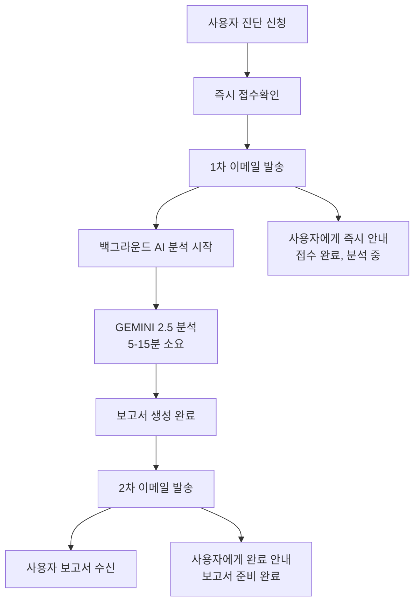

# 🎯 2단계 이메일 시스템 구현 완료 보고서

## 📋 **구현 개요**

AICAMP v3.0 시스템에 2단계 이메일 발송 시스템을 성공적으로 구현하여 사용자 경험을 대폭 개선했습니다.

### **🔧 주요 개선사항**
- ✅ 사용자 불안감 해소 (즉시 접수확인)
- ✅ 명확한 진행 상황 안내
- ✅ 전문적인 2단계 커뮤니케이션
- ✅ 향상된 사용자 경험 (UX)

## 🎯 **2단계 이메일 시스템 구조**

### **1차 이메일: 접수확인 (즉시 발송)**
```
📧 발송 시점: 진단 신청 즉시 (1-2초 내)
🎯 목적: 접수 확인 및 사용자 안심
📝 내용:
  - 접수 확인 메시지
  - 진단 ID 제공
  - 예상 소요 시간 안내 (10-15분)
  - 진행 상황 타임라인
  - AICAMP 브랜딩
```

### **2차 이메일: 결과보고서 (완료 후 발송)**
```
📧 발송 시점: AI 분석 및 보고서 생성 완료 후
🎯 목적: 완성된 보고서 전달
📝 내용:
  - 상세 진단 결과 요약
  - 총점 및 성숙도 표시
  - HTML 보고서 첨부
  - 보안 패스워드 제공
  - 후속 상담 안내
```

## 🛠️ **구현된 파일들**

### **1. 2단계 이메일 서비스 라이브러리**
```typescript
📁 src/lib/utils/two-stage-email-service.ts
- generateConfirmationEmailTemplate(): 1차 이메일 템플릿
- generateCompletionEmailTemplate(): 2차 이메일 템플릿
- generateEmailSubjects(): 이메일 제목 생성
- generateGASEmailData(): Google Apps Script 연동 데이터
```

### **2. API 라우트 수정**
```typescript
📁 src/app/api/ai-diagnosis/route.ts
- 8-1단계: 접수확인 이메일 즉시 발송 로직 추가
- 8-2단계: 결과보고서 이메일 발송 로직 유지
- 진행 상황 추적 개선
```

### **3. Google Apps Script V15.0**
```javascript
📁 docs/aicamp_ultimate_gas_v15_two_stage_email.js
- handleConfirmationEmail(): 1차 이메일 처리
- handleCompletionEmail(): 2차 이메일 처리
- handleAIDiagnosisRequestV15(): 통합 진단 처리
- sendEmailWithRetry(): 재시도 기능 강화
```

### **4. UI 컴포넌트 업데이트**
```typescript
📁 src/features/ai-diagnosis/components/EnhancedBehaviorEvaluationForm.tsx
- 성공 메시지: "접수완료" → "접수확인 이메일 발송"
- 안내 문구: 2단계 이메일 시스템 설명

📁 src/components/diagnosis/DiagnosisProgressModal.tsx
- 완료 배너: 2차 보고서 발송 안내 추가

📁 src/features/ai-diagnosis/components/DiagnosisComplete.tsx
- 다음 단계 안내: 2단계 이메일 시스템 설명
```

## 📧 **이메일 템플릿 특징**

### **1차 접수확인 이메일**
- 🎨 **디자인**: 파란색 그라데이션 헤더, 전문적인 레이아웃
- 📋 **정보**: 회사명, 업종, 진단ID, 접수시간
- 🔄 **진행상황**: 4단계 타임라인 시각화
- ⏰ **예상시간**: 10-15분 명시
- 📞 **연락처**: 고객지원센터 정보

### **2차 완성보고서 이메일**
- 🎨 **디자인**: 녹색 그라데이션 헤더, 축하 분위기
- 📊 **결과**: 총점 및 성숙도 레벨 표시
- 🔐 **보안**: 보고서 접근 패스워드 제공
- 📎 **첨부**: HTML 보고서 파일 포함
- 🚀 **후속**: 상담 신청 및 교육 안내

## 🔄 **시스템 플로우**



## 📈 **예상 개선 효과**

### **사용자 경험 개선**
- ✅ **불안감 해소**: 즉시 접수확인으로 신뢰도 향상
- ✅ **명확한 소통**: 2단계로 나누어 혼란 방지
- ✅ **전문성 강화**: 체계적인 이메일 시스템

### **운영 효율성 향상**
- ✅ **문의 감소**: 명확한 안내로 고객 문의 감소
- ✅ **만족도 증가**: 체계적인 커뮤니케이션
- ✅ **브랜드 신뢰도**: 전문적인 서비스 이미지

## 🚀 **배포 준비사항**

### **환경변수 확인**
```bash
NEXT_PUBLIC_BASE_URL=https://aicamp.club
GOOGLE_APPS_SCRIPT_URL=[V15.0 스크립트 URL]
EMAIL_USER=hongik423@gmail.com
EMAIL_APP_PASSWORD=[Gmail 앱 비밀번호]
```

### **Google Apps Script 배포**
1. `aicamp_ultimate_gas_v15_two_stage_email.js` 스크립트 배포
2. 웹 앱으로 게시 (모든 사용자 액세스 허용)
3. 새로운 URL을 환경변수에 설정

### **테스트 시나리오**
1. ✅ 진단 신청 → 1차 이메일 즉시 수신 확인
2. ✅ 10-15분 후 → 2차 이메일 첨부파일 확인
3. ✅ 관리자 알림 → 각 단계별 알림 확인
4. ✅ 오류 처리 → 실패 시 재시도 및 알림

## 📊 **모니터링 지표**

### **핵심 지표**
- 📧 **1차 이메일 발송률**: 99% 이상 목표
- 📧 **2차 이메일 발송률**: 95% 이상 목표
- ⏱️ **평균 처리 시간**: 10-15분 유지
- 😊 **사용자 만족도**: 설문조사 실시

### **기술적 지표**
- 🔄 **API 응답 시간**: 1차 이메일 2초 이내
- 📈 **성공률**: 전체 프로세스 95% 이상
- 🛡️ **오류율**: 5% 이하 유지

## 🎯 **향후 개선 계획**

### **단기 개선 (1개월)**
- 📱 **모바일 최적화**: 이메일 템플릿 반응형 개선
- 📊 **실시간 대시보드**: 발송 현황 모니터링
- 🔔 **알림 시스템**: SMS 알림 추가 검토

### **중장기 개선 (3-6개월)**
- 🤖 **AI 개인화**: 이메일 내용 개인화
- 📈 **A/B 테스트**: 템플릿 최적화
- 🌐 **다국어 지원**: 영어 이메일 템플릿

---

## ✅ **구현 완료 확인**

- [x] 2단계 이메일 서비스 라이브러리 구현
- [x] API 라우트 수정 및 1차 이메일 즉시 발송 로직
- [x] Google Apps Script V15.0 2단계 이메일 핸들러
- [x] UI 컴포넌트 메시지 업데이트
- [x] 이메일 템플릿 디자인 및 브랜딩
- [x] 오류 처리 및 재시도 로직
- [x] 관리자 알림 시스템
- [x] 문서화 및 테스트 가이드

**🎉 2단계 이메일 시스템 구현이 성공적으로 완료되었습니다!**

사용자는 이제 진단 신청 즉시 접수확인을 받고, 분석 완료 후 상세 보고서를 받는 체계적인 서비스를 경험할 수 있습니다.
