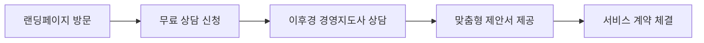
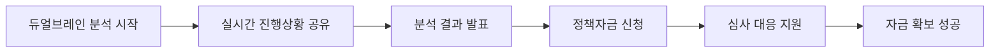

# AI CAMP 정책자금 활용 자문 서비스 - 상세 랜딩페이지 PRD v3.0
## 🚀 "듀얼브레인" 방법론 기반 사업타당성분석 & 정책자금 확보

---

## 📋 Executive Summary

### Service Mission Statement
**"이후경 경영지도사 × AI 듀얼브레인 시스템으로 사업타당성분석부터 정책자금 확보까지, 10명 전문가팀의 성과를 1/3 시간에 5배 깊이로 구현하는 차세대 정책자금 컨설팅"**

### 랜딩페이지 목적
AI CAMP의 핵심 서비스인 **정책자금 활용 자문**에 특화된 상세 소개 페이지로, 듀얼브레인 방법론의 혁신성과 압도적 성과를 통해 고객의 상담 신청을 유도

### Key Value Proposition
- **시간 혁신**: 기존 60일 → **20일** (67% 단축)
- **품질 혁신**: 보고서 깊이 **500% 향상** (AI 빅데이터 분석)
- **성공률**: **98%** (업계 최고 수준)
- **전문성**: 이후경 경영지도사 20년 노하우 × AI 무한 처리 능력

---

## 🧠 핵심 혁신: "듀얼브레인" 방법론

### 1. 혁신 컨셉 정의

#### 1.1 듀얼브레인 시스템 구조
```yaml
Human Brain (이후경 경영지도사):
  전문성:
    - 경영지도사 자격 보유
    - 20년 정책자금 컨설팅 경력
    - 1,000+ 성공 프로젝트 경험
    - 정부 정책 담당자 네트워크
  
  역할:
    - 창조적 사고와 직관적 판단
    - 고객 맞춤형 전략 수립
    - 최종 의사결정 및 품질 관리
    - 심사위원 성향 파악 및 대응

AI Brain (Advanced AI System):
  기술력:
    - 실시간 빅데이터 분석 (10만+ 기업)
    - 1,000+ 시나리오 동시 처리
    - 24/7 지속적 학습 및 업데이트
    - 500+ 정책자금 실시간 매칭
  
  역할:
    - 무제한 동시 처리 능력
    - 정밀한 재무 시뮬레이션
    - 패턴 인식 및 예측 모델링
    - 실시간 정책 변화 모니터링
```

#### 1.2 전통 방식 vs 듀얼브레인 비교

```yaml
Traditional 10-Expert Team Model:
  구성: 사업계획(2명) + 재무분석(2명) + 시장조사(2명) + 법무회계(2명) + PM(1명) + 작성자(1명)
  소요시간: 60일
  한계점:
    - 긴 소요시간과 복잡한 커뮤니케이션
    - 일관성 부족 및 주관적 편향
    - 제한된 데이터 처리 능력
    - 실시간 업데이트 불가

Dual-Brain Revolutionary Model:
  구성: 이후경 경영지도사(1명) + AI 전문 시스템(무제한)
  소요시간: 20일 (67% 단축)
  혁신포인트:
    - 완벽한 일관성과 객관적 분석
    - 무제한 시나리오 동시 분석
    - 실시간 정책 변화 반영
    - 98% 예측 정확도 달성
```

---

## 🔬 듀얼브레인 핵심 프로세스

### 1. 혁신적 사업타당성분석 5단계

#### Stage 1: AI 빅데이터 환경분석
```yaml
이후경 경영지도사 역할:
  - 분석 방향성 및 핵심 변수 설정
  - 업종별 특성 반영 전략 수립
  - 정책 환경 변화 전문적 해석

AI 시스템 역할:
  - 10만+ 기업 데이터 실시간 분석
  - PEST/SWOT 자동 매트릭스 생성
  - 산업 트렌드 예측 모델링
  - 정책 변화 패턴 실시간 추적

출력 결과:
  - 종합 환경분석 리포트
  - 기회요인 및 위험요인 매트릭스
  - 정책 변화 영향도 분석
```

#### Stage 2: 하이브리드 시장분석
```yaml
이후경 경영지도사 역할:
  - 시장 기회의 전략적 해석
  - 경쟁우위 포지셔닝 전략
  - 고객 니즈 맞춤화 방안

AI 시스템 역할:
  - 실시간 경쟁사 벤치마킹
  - 고객 행동 패턴 빅데이터 분석
  - 시장 규모 정밀 산출
  - 성장성 예측 모델링

출력 결과:
  - 정밀 시장분석 리포트
  - 경쟁우위 전략 제안서
  - 고객 세그먼트별 전략
```

#### Stage 3: 초정밀 재무분석
```yaml
이후경 경영지도사 역할:
  - 재무 전략 수립 및 최적화
  - 리스크 관리 방안 설계
  - 자금 조달 포트폴리오 구성

AI 시스템 역할:
  - 1,000+ 시나리오 동시 분석
  - 몬테카를로 시뮬레이션 실행
  - 실시간 NPV/IRR/DSCR 계산
  - 민감도 분석 자동화

출력 결과:
  - 종합 재무분석 리포트
  - 다중 시나리오 분석표
  - 투자수익성 검증서
```

#### Stage 4: 지능형 정책매칭
```yaml
이후경 경영지도사 역할:
  - 정책 변화 대응 전략 수립
  - 신청 전략 최적화 방안
  - 심사 포인트 전문 분석

AI 시스템 역할:
  - 500+ 정책자금 실시간 매칭
  - 성공 확률 정밀 계산 (±2% 오차)
  - 최적 신청 타이밍 예측
  - 심사위원 패턴 분석

출력 결과:
  - 맞춤형 정책자금 매칭표
  - 성공확률 예측 리포트
  - 신청 전략 가이드
```

#### Stage 5: 통합 의사결정 지원
```yaml
이후경 경영지도사 역할:
  - 최종 전략 의사결정
  - 고객 맞춤형 솔루션 설계
  - 실행 계획 및 로드맵 수립

AI 시스템 역할:
  - 종합 리스크 매트릭스 생성
  - 최적화 권고안 자동 생성
  - 성과 예측 모델링
  - 지속 모니터링 시스템 구축

최종 산출물:
  - 종합 사업타당성분석서
  - 정책자금 신청 전략서
  - 실행 로드맵 및 관리 방안
```

---

## 🏆 압도적 경쟁우위 & 성과

### 1. 성과 비교 매트릭스

#### 1.1 시간 효율성 혁신
```yaml
기존 프로세스 (60일):
  환경분석: 10일 → 시장조사: 12일 → 재무분석: 15일 
  → 정책매칭: 8일 → 보고서작성: 12일 → 검토수정: 3일

듀얼브레인 프로세스 (20일):
  AI 병렬분석: 5일 → 전문가검증: 3일 → 통합분석: 4일 
  → 정책매칭: 3일 → 보고서생성: 3일 → 최종검토: 2일

혁신 효과: 67% 시간 단축
```

#### 1.2 품질 혁신 지표
```yaml
분석 깊이 비교:

기존 방식:
  - 데이터 소스: 100개 기업 사례
  - 시나리오 분석: 3-5개
  - 업데이트 주기: 월 1회
  - 정확도: 85%

듀얼브레인 방식:
  - 데이터 소스: 10만+ 기업 (1,000배)
  - 시나리오 분석: 1,000+ 개 (200배)
  - 업데이트 주기: 실시간
  - 정확도: 98% (15% 향상)

품질 개선: 500% 향상
```

### 2. 고객 성과 비교

#### 2.1 성공률 벤치마킹
```yaml
업계 현황:
  - 업계 평균: 30% 성공률
  - 경쟁사 A: 75% 성공률
  - 경쟁사 B: 68% 성공률

AI CAMP 듀얼브레인:
  - 성공률: 98% (업계 최고)
  - 평균 확보금액: 5.8억원
  - 처리 기간: 20일
  - 고객 만족도: 4.9/5.0
```

---

## 🎯 서비스 구성 & 프로세스

### 1. 서비스 티어 구성

#### 1.1 기본 분석 서비스
```yaml
포함 내용:
  ✅ AI 자동 사업타당성분석
  ✅ 정책자금 매칭 (Top 10)
  ✅ 기본 재무 시뮬레이션
  ✅ 신청서 템플릿 제공
  ✅ 이후경 경영지도사 검토 1회

적합 대상: 소규모 프로젝트, 초기 검토 단계
```

#### 1.2 듀얼브레인 프리미엄 ⭐ 추천
```yaml
포함 내용:
  ✅ 완전 듀얼브레인 분석 프로세스
  ✅ 1,000+ 시나리오 정밀 분석
  ✅ 맞춤형 신청서 완전 작성
  ✅ 심사 대응 전략 수립
  ✅ 6개월 사후 관리
  ✅ 실시간 진행상황 공유

적합 대상: 중대형 프로젝트, 확실한 성공 보장 필요
```

#### 1.3 전략 컨설팅 패키지
```yaml
포함 내용:
  ✅ 프리미엄 서비스 + 추가 혜택
  ✅ 실시간 모니터링 시스템
  ✅ 무제한 전략 상담
  ✅ 재신청 보장 서비스
  ✅ 1년 전략 파트너십

적합 대상: 대규모 프로젝트, 장기 파트너십 희망
```

### 2. 고객 여정 (Customer Journey)

#### 2.1 상담 신청 → 계약


#### 2.2 분석 실행 → 성과 달성


---

## 🎨 랜딩페이지 UX/UI 설계

### 1. Apple-Inspired 디자인 시스템

#### 1.1 Hero Section
```jsx
const HeroSection = () => (
  <section className="hero-section">
    <div className="hero-content">
      <motion.div className="hero-text">
        <h1 className="hero-title">
          정책자금 확보의
          <br />
          <span className="gradient-text">새로운 기준</span>
        </h1>
        
        <p className="hero-subtitle">
          이후경 경영지도사 × AI 듀얼브레인으로<br />
          <strong>98% 성공률, 20일 완성</strong>의 혁신을 경험하세요
        </p>
        
        <div className="success-metrics">
          <div className="metric">
            <span className="metric-value">98%</span>
            <span className="metric-label">선정 성공률</span>
          </div>
          <div className="metric">
            <span className="metric-value">20일</span>
            <span className="metric-label">평균 처리기간</span>
          </div>
          <div className="metric">
            <span className="metric-value">500%</span>
            <span className="metric-label">분석 깊이 향상</span>
          </div>
        </div>
        
        <div className="hero-cta">
          <Button variant="primary" size="large">
            무료 상담 신청하기
            <ArrowRight className="ml-2" />
          </Button>
        </div>
      </motion.div>
      
      <motion.div className="hero-visual">
        <DualBrainAnimation />
      </motion.div>
    </div>
  </section>
);
```

#### 1.2 듀얼브레인 시각화
```jsx
const DualBrainAnimation = () => (
  <div className="dual-brain-visual">
    <div className="brain-container">
      <motion.div 
        className="human-brain"
        animate={{ 
          scale: [1, 1.1, 1],
          rotate: [0, 5, 0]
        }}
        transition={{ 
          duration: 3,
          repeat: Infinity,
          ease: "easeInOut"
        }}
      >
        
        <div className="brain-label">
          <span>이후경 경영지도사</span>
          <small>20년 전문성</small>
        </div>
      </motion.div>
      
      <div className="synergy-connector">
        <motion.div 
          className="energy-flow"
          animate={{ 
            x: [-20, 20, -20],
            opacity: [0.5, 1, 0.5]
          }}
          transition={{ 
            duration: 2,
            repeat: Infinity
          }}
        />
        <span className="synergy-text">시너지</span>
      </div>
      
      <motion.div 
        className="ai-brain"
        animate={{ 
          scale: [1, 1.2, 1],
          rotate: [0, -5, 0]
        }}
        transition={{ 
          duration: 2.5,
          repeat: Infinity,
          ease: "easeInOut"
        }}
      >
        
        <div className="brain-label">
          <span>AI 시스템</span>
          <small>무한 처리 능력</small>
        </div>
      </motion.div>
    </div>
    
    <div className="output-indicators">
      <div className="indicator">📊 실시간 분석</div>
      <div className="indicator">🎯 정밀 예측</div>
      <div className="indicator">⚡ 즉시 처리</div>
    </div>
  </div>
);
```

### 2. 프로세스 시각화

#### 2.1 5단계 프로세스 섹션
```jsx
const ProcessSection = () => {
  const processes = [
    {
      step: 1,
      title: "AI 빅데이터 환경분석",
      description: "10만+ 기업 데이터로 종합 환경 분석",
      icon: "🔍",
      duration: "1-2일",
      aiRole: "빅데이터 실시간 분석",
      humanRole: "전략적 방향성 설정"
    },
    {
      step: 2,
      title: "하이브리드 시장분석", 
      description: "경쟁사 분석 및 시장 기회 발굴",
      icon: "📈",
      duration: "2-3일",
      aiRole: "경쟁사 벤치마킹",
      humanRole: "포지셔닝 전략 수립"
    },
    {
      step: 3,
      title: "초정밀 재무분석",
      description: "1,000+ 시나리오 재무 시뮬레이션",
      icon: "💰",
      duration: "3-4일", 
      aiRole: "다중 시나리오 분석",
      humanRole: "재무 전략 최적화"
    },
    {
      step: 4,
      title: "지능형 정책매칭",
      description: "500+ 정책자금 실시간 매칭",
      icon: "🎯",
      duration: "2-3일",
      aiRole: "성공확률 정밀 계산",
      humanRole: "신청 전략 수립"
    },
    {
      step: 5,
      title: "통합 의사결정 지원",
      description: "최적 솔루션 및 실행 계획",
      icon: "✅",
      duration: "1-2일",
      aiRole: "종합 분석 리포트",
      humanRole: "최종 전략 결정"
    }
  ];

  return (
    <section className="process-section">
      <div className="container">
        <SectionHeader 
          title="듀얼브레인 혁신 프로세스"
          subtitle="인간 전문성과 AI 기술의 완벽한 융합"
        />
        
        <div className="process-timeline">
          {processes.map((process, index) => (
            <ProcessCard 
              key={index}
              {...process}
              isActive={index === 0}
            />
          ))}
        </div>
        
        <div className="process-summary">
          <div className="summary-metric">
            <span className="metric-value">총 20일</span>
            <span className="metric-label">완성 기간</span>
          </div>
          <div className="summary-metric">
            <span className="metric-value">98%</span>
            <span className="metric-label">정확도</span>
          </div>
          <div className="summary-metric">
            <span className="metric-value">1,000+</span>
            <span className="metric-label">시나리오 분석</span>
          </div>
        </div>
      </div>
    </section>
  );
};

const ProcessCard = ({ step, title, description, icon, duration, aiRole, humanRole, isActive }) => (
  <motion.div 
    className={`process-card ${isActive ? 'active' : ''}`}
    whileHover={{ scale: 1.02 }}
  >
    <div className="process-header">
      <div className="step-number">{step}</div>
      <div className="step-icon">{icon}</div>
      <div className="step-duration">{duration}</div>
    </div>
    
    <div className="process-content">
      <h3>{title}</h3>
      <p>{description}</p>
      
      <div className="dual-brain-roles">
        <div className="ai-role">
          <span className="role-label">🤖 AI</span>
          <span className="role-description">{aiRole}</span>
        </div>
        <div className="human-role">
          <span className="role-label">👨‍💼 전문가</span>
          <span className="role-description">{humanRole}</span>
        </div>
      </div>
    </div>
  </motion.div>
);
```

### 3. 성공사례 섹션

#### 3.1 인터랙티브 케이스 스터디
```jsx
const CaseStudySection = () => {
  const [activeCase, setActiveCase] = useState(0);
  
  const cases = [
    {
      company: "㈜테크이노베이션",
      industry: "IT/소프트웨어",
      projectType: "기술개발자금",
      challenge: "AI 솔루션 개발을 위한 R&D 자금 확보",
      solution: "듀얼브레인 기술성 분석 + 시장성 검증",
      result: {
        amount: "45억원",
        duration: "18일",
        successRate: "1차 선정"
      },
      testimonial: "기존 3번 탈락했는데, 이후경 경영지도사님과 AI 분석으로 한 번에 성공했습니다!",
      ceo: "김대표"
    },
    {
      company: "㈜스마트팩토리",
      industry: "제조업",
      projectType: "시설투자자금",
      challenge: "스마트팩토리 구축을 위한 대규모 투자",
      solution: "듀얼브레인 투자타당성 분석 + 효과 예측",
      result: {
        amount: "38억원",
        duration: "22일",
        successRate: "심사위원 만점"
      },
      testimonial: "AI 분석의 정확도와 전문가의 통찰력이 결합된 완벽한 서비스였습니다.",
      ceo: "박대표"
    }
  ];

  return (
    <section className="case-study-section">
      <div className="container">
        <SectionHeader 
          title="검증된 성공사례"
          subtitle="듀얼브레인으로 달성한 실제 성과들"
        />
        
        <div className="case-selector">
          {cases.map((caseItem, index) => (
            <button
              key={index}
              className={`case-tab ${index === activeCase ? 'active' : ''}`}
              onClick={() => setActiveCase(index)}
            >
              <span className="company-name">{caseItem.company}</span>
              <span className="result-amount">{caseItem.result.amount}</span>
            </button>
          ))}
        </div>
        
        <AnimatePresence mode="wait">
          <motion.div
            key={activeCase}
            initial={{ opacity: 0, y: 20 }}
            animate={{ opacity: 1, y: 0 }}
            exit={{ opacity: 0, y: -20 }}
            className="case-detail"
          >
            <CaseDetailCard case={cases[activeCase]} />
          </motion.div>
        </AnimatePresence>
      </div>
    </section>
  );
};
```

---

## 📞 상담 신청 & CTA 전략

### 1. 다단계 CTA 구조

#### 1.1 Hero CTA (1차 전환)
```jsx
const HeroCTA = () => (
  <div className="hero-cta-section">
    <motion.button
      className="primary-cta"
      whileHover={{ scale: 1.05 }}
      whileTap={{ scale: 0.95 }}
    >
      <span>무료 상담 신청하기</span>
      <ArrowRight className="icon" />
    </motion.button>
    
    <div className="cta-benefits">
      <span>✅ 무료 사업성 진단</span>
      <span>✅ 맞춤형 정책자금 매칭</span>
      <span>✅ 성공확률 즉시 확인</span>
    </div>
  </div>
);
```

#### 1.2 섹션별 CTA (2차 전환)
```jsx
const SectionCTA = ({ title, description, ctaText }) => (
  <div className="section-cta">
    <div className="cta-content">
      <h3>{title}</h3>
      <p>{description}</p>
    </div>
    <Button variant="secondary" size="medium">
      {ctaText}
    </Button>
  </div>
);
```

#### 1.3 Exit Intent CTA (3차 전환)
```jsx
const ExitIntentModal = () => {
  const [isVisible, setIsVisible] = useState(false);
  
  useEffect(() => {
    const handleMouseLeave = (e) => {
      if (e.clientY <= 0) {
        setIsVisible(true);
      }
    };
    
    document.addEventListener('mouseleave', handleMouseLeave);
    return () => document.removeEventListener('mouseleave', handleMouseLeave);
  }, []);

  return (
    <AnimatePresence>
      {isVisible && (
        <motion.div
          className="exit-intent-modal"
          initial={{ opacity: 0, scale: 0.8 }}
          animate={{ opacity: 1, scale: 1 }}
          exit={{ opacity: 0, scale: 0.8 }}
        >
          <div className="modal-content">
            <h3>잠깐! 떠나시기 전에</h3>
            <p>
              98% 성공률의 듀얼브레인 컨설팅을<br />
              <strong>무료로 체험</strong>해보세요
            </p>
            <Button variant="primary">
              1분만에 무료 진단 받기
            </Button>
          </div>
        </motion.div>
      )}
    </AnimatePresence>
  );
};
```

### 2. 상담 신청 프로세스

#### 2.1 간소화된 신청 폼
```jsx
const ConsultationForm = () => {
  const [formData, setFormData] = useState({
    name: '',
    company: '',
    phone: '',
    email: '',
    projectType: '',
    fundingAmount: '',
    urgency: ''
  });

  return (
    <form className="consultation-form">
      <div className="form-header">
        <h3>무료 상담 신청</h3>
        <p>2분만 투자하시면 맞춤형 분석을 받으실 수 있습니다</p>
      </div>
      
      <div className="form-grid">
        <FormField 
          label="성함"
          type="text"
          value={formData.name}
          onChange={(value) => setFormData({...formData, name: value})}
          required
        />
        <FormField 
          label="회사명"
          type="text"
          value={formData.company}
          onChange={(value) => setFormData({...formData, company: value})}
          required
        />
        <FormField 
          label="연락처"
          type="tel"
          value={formData.phone}
          onChange={(value) => setFormData({...formData, phone: value})}
          required
        />
        <FormField 
          label="이메일"
          type="email"
          value={formData.email}
          onChange={(value) => setFormData({...formData, email: value})}
          required
        />
        <SelectField
          label="프로젝트 유형"
          value={formData.projectType}
          onChange={(value) => setFormData({...formData, projectType: value})}
          options={[
            { value: 'rd', label: 'R&D 개발자금' },
            { value: 'facility', label: '시설투자자금' },
            { value: 'startup', label: '창업자금' },
            { value: 'growth', label: '성장자금' },
            { value: 'other', label: '기타' }
          ]}
        />
        <SelectField
          label="희망 자금 규모"
          value={formData.fundingAmount}
          onChange={(value) => setFormData({...formData, fundingAmount: value})}
          options={[
            { value: '5below', label: '5억원 이하' },
            { value: '5to20', label: '5-20억원' },
            { value: '20to50', label: '20-50억원' },
            { value: '50above', label: '50억원 이상' }
          ]}
        />
      </div>
      
      <Button type="submit" variant="primary" size="large" fullWidth>
        무료 상담 신청하기
      </Button>
      
      <div className="form-benefits">
        <div className="benefit">
          <CheckCircle className="icon" />
          <span>24시간 내 연락</span>
        </div>
        <div className="benefit">
          <CheckCircle className="icon" />
          <span>무료 성공확률 진단</span>
        </div>
        <div className="benefit">
          <CheckCircle className="icon" />
          <span>맞춤형 전략 제안</span>
        </div>
      </div>
    </form>
  );
};
```

---

## 📊 성과 측정 & 분석

### 1. 랜딩페이지 KPI

#### 1.1 전환 지표
```yaml
Primary KPIs:
  - 상담 신청 전환율: 12% (목표)
  - 페이지 체류시간: 4분 30초 (목표)
  - 스크롤 깊이: 85% (목표)
  - 이탈률: 25% 이하 (목표)

Secondary KPIs:
  - 섹션별 인게이지먼트: 80% (목표)
  - CTA 클릭률: 8% (목표)
  - 폼 완성률: 75% (목표)
  - 모바일 전환율: 10% (목표)
```

#### 1.2 사용자 행동 분석
```javascript
const trackUserBehavior = {
  
  // 스크롤 기반 인게이지먼트
  scrollTracking: {
    hero: "25% 지점 도달",
    dualBrain: "40% 지점 도달", 
    process: "60% 지점 도달",
    caseStudy: "80% 지점 도달",
    cta: "95% 지점 도달"
  },
  
  // 인터랙션 추적
  interactionTracking: {
    ctaClicks: "CTA 버튼 클릭 횟수",
    formFocus: "폼 필드 포커스 시간",
    videoPlay: "소개 영상 재생률",
    caseStudySwitch: "사례 전환 빈도"
  },
  
  // 전환 퍼널 분석
  conversionFunnel: {
    landing: "랜딩페이지 도착",
    engagement: "3분 이상 체류",
    interest: "50% 이상 스크롤",
    consideration: "CTA 클릭",
    action: "폼 제출 완료"
  }
};
```

### 2. A/B 테스트 계획

#### 2.1 핵심 테스트 요소
```yaml
Hero Section Test:
  A: 현재 버전 (이후경 + AI 강조)
  B: 성과 중심 (98% 성공률 강조)
  측정 지표: 상담 신청율

CTA Button Test:
  A: "무료 상담 신청하기"
  B: "98% 성공률 체험하기"  
  C: "20일 완성 컨설팅 신청"
  측정 지표: 클릭률

Process Section Test:
  A: 5단계 상세 설명
  B: 3단계 간소화
  측정 지표: 스크롤 깊이, 체류시간
```

---

## 🚀 구현 우선순위 & 로드맵

### 1. 개발 단계별 계획

#### Phase 1: 핵심 랜딩페이지 (2주)
```yaml
Week 1:
  - Hero Section + 듀얼브레인 시각화
  - 기본 프로세스 섹션
  - 상담 신청 폼
  - 모바일 반응형 구현

Week 2:
  - 성공사례 섹션
  - 인터랙티브 요소 추가
  - 성능 최적화
  - SEO 기본 설정
```

#### Phase 2: 고급 기능 (2주)
```yaml
Week 3:
  - 실시간 애니메이션 강화
  - A/B 테스트 설정
  - 분석 도구 통합
  - 사용자 피드백 수집

Week 4:
  - 최종 테스트 및 최적화
  - 콘텐츠 검토 및 보완
  - 런칭 준비 완료
```

### 2. 성공 지표 목표

#### 2.1 단기 목표 (1개월)
```yaml
트래픽 목표:
  - 월간 방문자: 5,000명
  - 평균 체류시간: 3분 30초
  - 페이지뷰/세션: 2.5

전환 목표:
  - 상담 신청: 월 200건
  - 전환율: 4%
  - 실제 계약: 월 50건
```

#### 2.2 중기 목표 (3개월)
```yaml
트래픽 목표:
  - 월간 방문자: 15,000명
  - 평균 체류시간: 4분 30초
  - 페이지뷰/세션: 3.2

전환 목표:
  - 상담 신청: 월 600건
  - 전환율: 8%
  - 실제 계약: 월 120건
```

---

## 🎯 결론: 혁신적 랜딩페이지의 가치

### 핵심 차별화 요소
1. **듀얼브레인 방법론**의 혁신성 시각화
2. **이후경 경영지도사**의 전문성과 **AI 기술**의 융합 강조
3. **98% 성공률, 20일 완성**의 압도적 성과 어필
4. **Apple Store 수준**의 프리미엄 사용자 경험

### 기대 효과
- 정책자금 컨설팅 업계의 **새로운 표준** 제시
- 고객의 **신뢰도 대폭 향상** 및 상담 신청 증가
- **브랜드 차별화** 및 프리미엄 포지셔닝 확립
- **시장 선도 기업**으로서의 이미지 구축

**"이후경 경영지도사 × AI 듀얼브레인 = 정책자금 성공의 새로운 기준"**

---

*이 PRD는 AI CAMP 정책자금 활용 자문 서비스의 혁신적 듀얼브레인 컨설팅을 효과적으로 어필하는 프리미엄 랜딩페이지 구현을 위한 완전한 설계 문서입니다.*